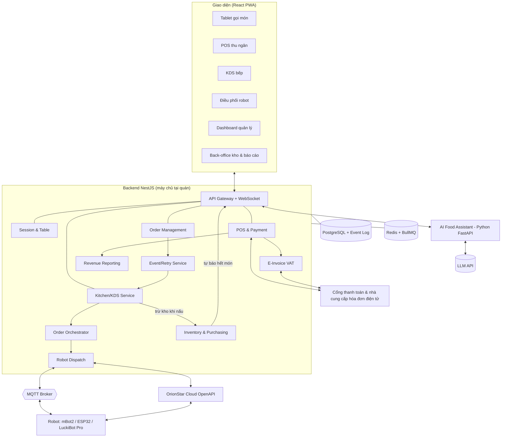

# Nha Hang Sen — Technical Specification v0.5

# Tài liệu công nghệ – Hệ thống nhà hàng thông minh tích hợp AI & Robot

> Phiên bản 0.4 (bổ sung báo cáo doanh thu, quản lý nguyên liệu, xuất hóa đơn VAT, thách thức kỹ thuật, kế hoạch sprint) · Soạn từ tài liệu "Đề xuất giải pháp nhà hàng thông minh tích hợp AI & Robot (v2)" và bản demo "Nhà hàng Sen".
> Mục đích: thống nhất kiến trúc, ngôn ngữ lập trình, công nghệ và quy ước kỹ thuật trước khi xây MVP.

---

## 1. Tóm tắt lựa chọn công nghệ

| Hạng mục | Lựa chọn đề xuất | Lý do chính |
|---|---|---|
| Ngôn ngữ chính | **TypeScript** (frontend + backend) | Một ngôn ngữ cho cả nhóm, dùng chung kiểu dữ liệu (Order, Session…) giữa các màn hình và máy chủ |
| Ngôn ngữ cho AI | **Python** | Hệ sinh thái AI/LLM tốt nhất; tách thành dịch vụ riêng |
| Ngôn ngữ cho robot demo | **MicroPython** (mBot2) / **C++ Arduino** (xe ESP32 tự lắp) | Ngôn ngữ chính thức của từng loại bo mạch |
| Giao diện | **React + Vite**, chạy dạng **PWA** | Chạy trên tablet, máy POS, màn hình bếp chỉ bằng trình duyệt; cài như app, chế độ kiosk |
| Backend | **Node.js 20 LTS + NestJS** | Chia module rõ ràng, khớp 10 module nghiệp vụ; hỗ trợ sẵn REST, WebSocket, hàng đợi |
| Cơ sở dữ liệu | **PostgreSQL 16** | Giao dịch chặt chẽ (bill, thanh toán), hỗ trợ JSON, khóa duy nhất cho idempotency |
| ORM | **Prisma** | Kiểu dữ liệu an toàn, migration dễ quản lý |
| Hàng đợi & cache | **Redis 7 + BullMQ** | Retry gửi bếp, hẹn giờ gom món, pub/sub real-time |
| Real-time cho màn hình | **WebSocket (Socket.IO)** | Tablet, POS, KDS, Dashboard cập nhật tức thì |
| Kết nối robot | **MQTT** (Mosquitto/EMQX tự dựng, HiveMQ Cloud khi demo) + **HTTPS** (API hãng) | MQTT nhẹ, hợp thiết bị IoT; HTTPS cho cloud API như OrionStar |
| Triển khai | **Docker + Docker Compose**, máy chủ tại quán (edge) + cloud | Quán vẫn chạy khi mất Internet; cloud cho báo cáo, nhiều chi nhánh |
| Báo cáo & xuất file | **SQL tổng hợp + bảng tổng hợp theo ngày**, xuất Excel bằng **ExcelJS**, PDF bằng **Playwright** | Số liệu nhanh, khớp tuyệt đối với bill; xuất file cho kế toán |
| Hóa đơn điện tử (VAT) | **Kết nối API nhà cung cấp hóa đơn điện tử** qua lớp adapter | Không tự làm phần ký, truyền dữ liệu lên cơ quan thuế; đổi nhà cung cấp không ảnh hưởng hệ thống |
| Quét mã khi nhập kho | **Camera điện thoại qua PWA** (thư viện ZXing) | Không cần mua máy quét riêng lúc đầu |
| Giám sát | **Sentry** (lỗi), **Prometheus + Grafana** (chỉ số), **Loki** (log) | Phát hiện sớm lỗi ACK, robot, thanh toán |
| Kiểm thử | **Vitest**, **Playwright** (E2E), **k6** (tải) | Kiểm tra luồng lỗi mạng, order trùng, giờ cao điểm |

**Nguyên tắc:** ưu tiên công nghệ phổ biến, dễ tuyển người tại Việt Nam, mã nguồn mở, không khóa vào một nhà cung cấp.

---


## BỔ SUNG v0.5 — PRODUCT REQUIREMENTS & SCOPE

> Phần này bổ sung lớp yêu cầu sản phẩm trước khi đi sâu vào thiết kế kỹ thuật. Nội dung kỹ thuật hiện có được giữ nguyên.

### PR-01. Mục tiêu sản phẩm

Nha Hang Sen là hệ thống quản lý nhà hàng theo hướng **local-first/offline-first**, kết nối các thành phần:

- Tablet/Customer Ordering
- POS/Cashier
- KDS/Kitchen
- Printer
- Payment
- E-invoice
- Inventory
- AI Food Assistant
- Robot delivery
- Monitoring & Operations

Mục tiêu chính:

1. Giảm thời gian từ gọi món → bếp nhận món.
2. Không mất/nhân đôi order khi mạng chập chờn.
3. Hỗ trợ vận hành nhà hàng ngay cả khi Internet tạm thời mất.
4. Chuẩn hóa thanh toán, hóa đơn và đối soát.
5. Có nền tảng để mở rộng AI, inventory và robot mà không phá vỡ core ordering.
6. Có khả năng mở rộng từ một nhà hàng lên nhiều chi nhánh.

### PR-02. Người dùng / vai trò

| Vai trò | Trách nhiệm chính |
|---|---|
| Guest/Customer | Xem menu, chọn món, gửi order |
| Waiter/Staff | Hỗ trợ order, chuyển bàn, xử lý nghiệp vụ tại bàn |
| Cashier | Thanh toán, split/merge bill, hoàn/hủy theo quyền |
| Kitchen | Nhận và xử lý món trên KDS |
| Manager | Quản lý menu, ca, discount, báo cáo, phê duyệt |
| Accountant | Đối soát thanh toán, hóa đơn điện tử |
| Admin | User, device, system configuration, integration |
| Technician | Monitoring, backup, recovery, troubleshooting |
| Robot Operator | Theo dõi robot, xử lý lỗi giao món |

### PR-03. User journey chính

```text
Khách đến nhà hàng
      ↓
Bàn / Dining Session
      ↓
Tablet / QR / POS
      ↓
Xem Menu
      ↓
Modifier / Add-on / Discount (nếu có)
      ↓
Cart local
      ↓
Create Order + Idempotency
      ↓
Outbox
      ↓
KDS
      ↓
Preparing → Ready
      ↓
Staff / Robot Delivery
      ↓
Bill
      ↓
Payment
      ↓
E-invoice (nếu yêu cầu)
      ↓
Close Table / Cleaning
      ↓
Report / Audit
```

### PR-04. MVP / Phase 2 / Phase 3

| Giai đoạn | Phạm vi |
|---|---|
| MVP | Auth/RBAC, device, menu, table, dining session, cart, order, KDS, printer, bill, payment, shift, audit, monitoring, backup/restore, e-invoice sandbox |
| Phase 2 | AI Food Assistant, inventory, recipe, food cost, promotion/voucher nâng cao |
| Phase 3 | Robot orchestration, robot delivery, multi-branch, advanced analytics |
| Non-goal MVP | Không bắt buộc AI phải tạo order; không phụ thuộc robot để hoàn thành luồng order; không triển khai multi-branch hoàn chỉnh nếu chưa cần |

### PR-05. Tiêu chí thành công

- Không mất hoặc duplicate order trong các kịch bản retry/network failure đã định nghĩa.
- KDS nhận order trong SLA đã đặt.
- Thanh toán và đối soát khớp.
- Có thể phục hồi hệ thống từ backup.
- Có thể vận hành với Internet bị gián đoạn theo offline policy.
- Staff có thể hoàn thành luồng order → kitchen → payment mà không cần thao tác kỹ thuật.


## 2. Kiến trúc tổng thể



**Thiết kế hướng sự kiện:** mọi thay đổi quan trọng (order xác nhận, bếp ACK, món Ready, robot tới bàn, thanh toán thành công) đều ghi thành **sự kiện** vào bảng `event_log`, rồi phát cho các module liên quan. Cách này giúp retry an toàn, truy vết được, và tách logic nghiệp vụ khỏi từng loại robot.

**Máy chủ tại quán (edge):** chạy trên một mini PC trong mạng LAN của nhà hàng. Tablet, POS, KDS và robot kết nối qua Wi-Fi nội bộ nên vẫn hoạt động khi mất Internet. Dữ liệu được đồng bộ lên cloud khi có mạng (giai đoạn mở rộng nhiều chi nhánh).

---

## 3. Ngôn ngữ & công nghệ theo từng thành phần

### 3.1. Giao diện (5 màn hình vận hành + back-office)

| Màn hình | Người dùng | Thiết bị gợi ý | Ghi chú kỹ thuật |
|---|---|---|---|
| Tablet gọi món | Khách | Tablet Android 10–11 inch, chế độ kiosk | Ghép thiết bị với bàn bằng mã; lưu tạm giỏ hàng khi rớt mạng |
| POS thu ngân | Thu ngân | Máy tính/POS cảm ứng + máy in nhiệt | In hóa đơn và phiếu dự phòng qua ESC/POS |
| KDS bếp | Bếp | Màn hình 21–24 inch chống dầu mỡ | Gửi ACK ngay khi nhận order; âm báo; chạm to, dễ bấm |
| Điều phối robot | Quản lý ca | Tablet/PC | Hàng chờ giao, trạng thái robot, nút fallback nhân viên |
| Dashboard | Chủ/quản lý | PC, điện thoại | Doanh thu, bàn, bếp, robot theo thời gian thực |
| Back-office (Kho & Báo cáo) | Thủ kho, bếp trưởng, kế toán, chủ | PC, điện thoại | Nhập/xuất/kiểm kê nguyên liệu, định lượng món, báo cáo doanh thu và xuất Excel |

- **Ngôn ngữ:** TypeScript
- **Framework:** React 18 + Vite; định tuyến bằng React Router
- **Giao diện:** Tailwind CSS + bộ component dùng chung (`packages/ui`)
- **Dữ liệu:** TanStack Query (gọi API) + Socket.IO client (real-time); Zustand cho trạng thái cục bộ (giỏ hàng)
- **Đa ngôn ngữ:** i18next (Tiếng Việt, English, 中文, 한국어 cho khách du lịch)
- **Biểu đồ Dashboard:** Recharts hoặc ECharts
- **PWA:** Service Worker để cache menu, ảnh món; hàng đợi gửi lại khi mất mạng

### 3.2. Backend

- **Ngôn ngữ:** TypeScript trên Node.js 20 LTS
- **Framework:** NestJS, mỗi module nghiệp vụ là một NestJS module
- **API:** REST (JSON) + WebSocket (Socket.IO gateway), mô tả bằng OpenAPI/Swagger
- **Kiểm tra dữ liệu vào:** Zod hoặc class-validator
- **Hàng đợi:** BullMQ trên Redis cho: gửi lại order tới bếp, hẹn giờ gom món, hết hạn SLA, gọi lại webhook
- **Xác thực:** JWT + phân quyền theo vai trò (RBAC); thiết bị (tablet, KDS) dùng token thiết bị riêng

**10 module theo tài liệu giải pháp, bổ sung 3 module (11–13):**

| # | Module | Trách nhiệm |
|---|---|---|
| 01 | Session & Table | Bàn, sơ đồ, Dining Session, Guest Group, chuyển/gộp bàn |
| 02 | Digital Menu | Món, danh mục, giá, hình, tag (chay, cay, trẻ em), tình trạng còn/hết |
| 03 | AI Food Assistant | Cầu nối tới dịch vụ AI Python |
| 04 | Order Management | Giỏ hàng, xác nhận, idempotency, trạng thái order/món |
| 05 | POS & Payment | Bill, tách/gộp bill, khóa bill, thanh toán, hóa đơn điện tử |
| 06 | Kitchen Display (KDS) | Gửi phiếu, nhận ACK, trạng thái chế biến, báo hết món |
| 07 | Order Orchestrator | Hàng chờ Ready, gom món, ưu tiên SLA |
| 08 | Robot Dispatch | Chọn robot, tạo chuyến, pickup xác thực, fallback |
| 09 | Event/Retry Service | Event log, outbox, retry, cảnh báo |
| 10 | Admin & Audit Log | Người dùng, phân quyền, cấu hình, nhật ký thao tác |
| 11 | **Revenue Reporting** | Báo cáo doanh thu, kết ca, đối soát thanh toán, xuất file |
| 12 | **Inventory & Purchasing** | Nguyên liệu, nhà cung cấp, định lượng món, nhập/xuất/tồn, kiểm kê, giá vốn |
| 13 | **E-Invoice (VAT)** | Thuế suất theo món, xuất hóa đơn điện tử, thông tin người mua, điều chỉnh/thay thế, đối soát |

### 3.3. Cơ sở dữ liệu

- **PostgreSQL 16** là nguồn dữ liệu chính. Mọi thao tác tiền bạc (bill, payment) chạy trong transaction.
- **Redis 7:** cache menu, trạng thái robot tức thời, pub/sub giữa các tiến trình, hàng đợi BullMQ.
- **Sao lưu:** bản sao tự động hằng ngày lên cloud; giữ tối thiểu 30 ngày.

### 3.4. Dịch vụ AI tư vấn món

- **Ngôn ngữ:** Python 3.12
- **Framework:** FastAPI
- **Mô hình:** gọi LLM qua API (ví dụ Claude của Anthropic) có hỗ trợ **tool use**
- **Công cụ AI được phép gọi:**
  - `lay_menu_con_hang(bo_loc)` – chỉ trả món đang còn, lấy trực tiếp từ Digital Menu
  - `them_vao_gio(session_id, mon, so_luong)` – chỉ thêm vào giỏ
- **AI không có công cụ xác nhận order hay thanh toán.** Khách luôn phải tự bấm "Xác nhận gọi món" (nguyên tắc an toàn nghiệp vụ trong tài liệu giải pháp).
- **Kiểm soát:** giới hạn chủ đề (chỉ tư vấn món), kiểm tra lại mã món và giá do AI trả về với cơ sở dữ liệu trước khi hiển thị, ghi log hội thoại để cải tiến.
- **Dự phòng:** khi LLM chậm hoặc lỗi, dùng bộ gợi ý theo luật (như bản demo) để khách vẫn được tư vấn.

> Nếu muốn giữ một ngôn ngữ duy nhất, có thể viết dịch vụ AI bằng TypeScript (SDK Anthropic có bản TypeScript). Python được đề xuất vì dễ mở rộng sang gợi ý theo dữ liệu bán hàng về sau.

### 3.5. Kết nối robot

| Loại robot | Ngôn ngữ / giao thức | Dùng khi |
|---|---|---|
| Robot giả lập | TypeScript (trong backend) | Phát triển, trình diễn không cần phần cứng |
| Makeblock mBot2 | MicroPython trên CyberPi (ESP32) + MQTT | Demo thử giao món trên sa bàn |
| Xe ESP32 tự lắp | C++ (Arduino IDE / PlatformIO) + MQTT | Demo chi phí thấp |
| OrionStar LuckiBot Pro | HTTPS tới OrionStar OpenAPI + webhook callback | Triển khai thật |
| Ứng dụng chạy trên robot OrionStar (tùy chọn) | Kotlin/Java, RobotOS SDK (Android) | Khi cần tùy biến màn hình, giọng nói trên robot |

Chi tiết ở mục 7.

### 3.6. Thanh toán & hóa đơn

- **QR ngân hàng:** tạo mã theo chuẩn VietQR đúng số tiền và nội dung là mã bill; nhận xác nhận qua webhook của đơn vị trung gian (cần đánh giá: PayOS, Casso, cổng của ngân hàng…).
- **Ví điện tử / thẻ:** tích hợp cổng như VNPay, MoMo, ZaloPay hoặc máy POS ngân hàng (cần chọn đối tác).
- **Tiền mặt:** thu ngân xác nhận thủ công, có ghi Audit Log.
- **Hóa đơn điện tử (VAT):** xem chi tiết ở mục 12.
- **In ấn:** máy in nhiệt 80mm dùng lệnh ESC/POS, qua một tiến trình in chạy tại quán.

### 3.7. Hạ tầng & vận hành

- **Đóng gói:** Docker; `docker-compose.yml` gồm `api`, `ai`, `postgres`, `redis`, `mqtt`, `web`.
- **Máy chủ tại quán:** mini PC (4 nhân, 16 GB RAM, SSD 512 GB) + UPS; router Wi-Fi riêng cho thiết bị nhà hàng, tách mạng khách.
- **Cloud (giai đoạn mở rộng):** máy chủ tại Việt Nam hoặc khu vực gần; đồng bộ báo cáo, quản lý nhiều chi nhánh.
- **CI/CD:** GitHub Actions: kiểm tra code, chạy test, build image, triển khai.
- **Cập nhật:** triển khai ngoài giờ phục vụ; luôn có cách quay lại bản trước.

---

## 4. Mô hình dữ liệu chính

**Nguyên tắc cốt lõi:** Dining Session là "nguồn sự thật"; bàn chỉ là vị trí phục vụ.

```
DiningSession ─┬─< TableAssignment >── Table
               ├─< GuestGroup
               ├─< Bill ─< BillLine >── OrderItem
               └─< Order ─< OrderItem >── MenuItem
Order ─< KitchenTicket (ACK)
DeliveryTrip >─< OrderItem ; DeliveryTrip >── Robot
Bill ─< Payment ; Bill ── EInvoice
MenuItem ─< RecipeLine >── Ingredient ─< StockLot
Ingredient ─< StockMovement ; Supplier ─< PurchaseOrder ─< GoodsReceipt
EventLog, AuditLog (toàn hệ thống)
```

| Bảng | Trường quan trọng |
|---|---|
| `tables` | id, mã bàn, số ghế, khu vực, trạng thái (AVAILABLE, DINING, PAYMENT, CLEANING, RESERVED) |
| `dining_sessions` | id (vd. DS-2026-152), số khách, giờ mở/đóng, trạng thái, ghi chú |
| `table_assignments` | session_id, table_id, từ lúc, đến lúc (lưu lịch sử chuyển/gộp bàn) |
| `guest_groups` | session_id, tên nhóm (G1, G2…) – dùng khi tách bill theo nhóm |
| `menu_items` | mã, tên, danh mục, giá, tags, còn/hết, trạm bếp phụ trách |
| `orders` | id (#001), session_id, **idempotency_key (UNIQUE)**, trạng thái, tổng tiền, nguồn (tablet/POS/AI) |
| `order_items` | order_id, menu_item_id, số lượng, ghi chú, giá tại thời điểm gọi, trạng thái từng món |
| `kitchen_tickets` | order_id, trạm, số lần gửi, thời điểm ACK, trạng thái (SENT, ACKED, FALLBACK) |
| `robots` | id, hãng, model, mã seri, pin, trạng thái, vị trí, khu vực |
| `delivery_trips` | id (TR001), robot_id, bàn đích, danh sách món, giai đoạn, thời điểm từng bước, lý do hủy |
| `bills` | số bill (B005-00152), session_id, nhóm khách, tạm tính, VAT, giảm giá, trạng thái (OPEN, LOCKED, PAID) |
| `payments` | bill_id, phương thức, số tiền, mã giao dịch cổng, trạng thái |
| `event_log` | id, loại sự kiện, đối tượng, dữ liệu JSON, thời điểm (append-only) |
| `audit_log` | người thực hiện, hành động (hủy món, giảm giá, mở khóa bill…), trước/sau |

Bảng cho báo cáo, kho và hóa đơn điện tử được mô tả ở mục 10, 11 và 12.

---

## 5. Máy trạng thái

### 5.1. Order / món
```
Draft → Confirmed → Sent → KDS_ACK → Preparing → Ready → Assigned → PickedUp → Delivered
                      │
                      └─(không ACK sau N lần)→ Fallback → (bếp nhập tay) → KDS_ACK
Bất kỳ trạng thái trước Preparing → Cancelled (cần quyền, ghi Audit Log)
```

### 5.2. Bàn
```
AVAILABLE → DINING → PAYMENT → CLEANING → AVAILABLE
AVAILABLE → RESERVED → DINING
```

### 5.3. Chuyến giao robot
```
Created → Assigned → AtPickup → (quét QR khớp) → Moving → Arrived → Delivered → Returning → Done
Moving/AtPickup → Failed (kẹt, hết pin, mất kết nối) → món quay lại hàng chờ Ready
```

### 5.4. Bill
```
OPEN → LOCKED → PAID → (xuất hóa đơn) → CLOSED
LOCKED → OPEN (mở khóa, cần quyền)
```

---

## 6. Độ tin cậy: ACK, Retry & Idempotency

Mục tiêu theo tài liệu giải pháp: **không mất order, không nhân đôi order, truy vết được.**

1. **Idempotency Key:** tablet tạo một khóa ngẫu nhiên cho mỗi giỏ hàng, gửi kèm khi xác nhận. Cột `orders.idempotency_key` có ràng buộc UNIQUE. Khách bấm 2 lần hoặc mạng gửi lại thì backend trả lại order đã có, không tạo mới.
2. **Outbox pattern:** khi tạo order, backend ghi order và sự kiện `order.confirmed` trong **cùng một transaction**. Tiến trình riêng đọc outbox và gửi tới KDS, nên không có chuyện lưu order xong mà quên gửi bếp.
3. **ACK từ KDS:** KDS gửi `kitchen.ack {order_id, station, timestamp}` ngay khi nhận. Chỉ sau ACK, tablet mới hiện "Bếp đã nhận".
4. **Retry có kiểm soát:** không có ACK sau 3 giây → gửi lại (BullMQ, tối đa 3 lần, giãn cách tăng dần). Hết lượt → trạng thái `Fallback`, cảnh báo POS/quản lý, in phiếu giấy.
5. **KDS xử lý trùng:** KDS bỏ qua phiếu có `order_id` đã nhận, chỉ gửi lại ACK.
6. **Tương tự cho robot và thanh toán:** mỗi lệnh robot có `trip_id`; mỗi webhook thanh toán kiểm tra mã giao dịch để không cộng tiền hai lần.

### Danh sách sự kiện chính

| Sự kiện | Phát ra khi |
|---|---|
| `session.opened`, `session.moved`, `session.closed` | Mở phiên, chuyển bàn, đóng phiên |
| `order.confirmed`, `order.cancelled` | Khách xác nhận / hủy món |
| `kitchen.sent`, `kitchen.ack`, `kitchen.fallback` | Gửi bếp / bếp nhận / hết lượt retry |
| `kitchen.preparing`, `kitchen.ready` | Bếp bắt đầu / xong món |
| `menu.soldout`, `menu.available` | Báo hết / bán lại |
| `trip.assigned`, `trip.picked_up`, `trip.arrived`, `trip.delivered`, `trip.failed` | Các bước giao món |
| `robot.status` | Pin, vị trí, lỗi |
| `bill.locked`, `payment.succeeded`, `payment.failed`, `payment.refunded` | Thanh toán / hoàn tiền |
| `shift.closed`, `business_day.closed` | Kết ca, chốt ngày kinh doanh |
| `stock.received`, `stock.consumed`, `stock.wasted`, `stock.adjusted` | Nhập, tiêu hao theo món, hủy, điều chỉnh kiểm kê |
| `stock.low`, `stock.expiring` | Dưới mức tồn tối thiểu, sắp hết hạn |
| `einvoice.requested`, `einvoice.issued`, `einvoice.failed`, `einvoice.adjusted` | Yêu cầu, phát hành, lỗi, điều chỉnh hóa đơn điện tử |

---

## 7. Tích hợp robot

### 7.1. Robot Adapter – lớp trung gian

Bộ điều phối không gọi trực tiếp một hãng robot nào. Mỗi loại robot có một adapter tuân theo cùng một giao diện:

```ts
export interface RobotAdapter {
  /** Gửi robot lấy món tại điểm pickup và giao tới bàn */
  giaoMon(robotId: string, trip: { tripId: string; banDich: string; mon: string[] }): Promise<void>;
  /** Pin, vị trí, đang làm gì */
  layTrangThai(robotId: string): Promise<RobotStatus>;
  /** Hủy chuyến (robot kẹt, đổi robot khác) */
  huyChuyen(robotId: string, tripId: string): Promise<void>;
  /** Đăng ký nhận sự kiện: đã tới, đã nhận món, lỗi, pin yếu */
  onSuKien(handler: (e: RobotEvent) => void): void;
}
```

Các adapter: `SimulatedAdapter` (giả lập), `MqttToyAdapter` (mBot2, ESP32), `OrionStarAdapter` (LuckiBot Pro), `ManualAdapter` (nhân viên tự bấm trên robot, app chỉ theo dõi).

### 7.2. Ba mức tích hợp

| Mức | Cách làm | Khi nào |
|---|---|---|
| 1. Thủ công | Nhân viên chọn bàn trên màn hình robot; app chỉ ghi nhận bằng nút bấm | MVP, khi robot chưa có API |
| 2. Cloud API | Backend gọi API hãng, nhận webhook trạng thái | Triển khai chính |
| 3. SDK trên robot | Ứng dụng Android chạy trên robot | Khi cần tùy biến màn hình/giọng nói |

### 7.3. OrionStar LuckiBot Pro (triển khai thật)

- **Giao thức:** HTTPS REST tới OrionStar Robot OpenAPI; nhận callback sự kiện tác vụ qua webhook.
- **Điều kiện:** xin tài khoản OpenAPI (appid, secret) qua bộ phận kỹ thuật trước bán hàng của OrionStar hoặc nhà phân phối tại Việt Nam; dùng đúng địa chỉ máy chủ theo khu vực.
- **Các nhóm API cần dùng:** lấy danh sách robot; lấy danh sách vị trí trên bản đồ (khớp với mã bàn); chuyển chế độ làm việc (giao món, dẫn khách, thu khay); ra lệnh đi tới vị trí; hủy di chuyển; phát giọng nói; đi sạc.
- **Việc chuẩn bị:** nhà phân phối quét bản đồ, đặt tên điểm trùng mã bàn (`T05` ↔ "Bàn 05"), điểm "Bếp", "Trạm sạc".
- **Câu hỏi cần hỏi nhà phân phối:** có lệnh giao nhiều bàn trong một chuyến cho LuckiBot Pro không; độ trễ callback; hoạt động khi mất Internet; phí API; tài khoản thử nghiệm.

### 7.4. Robot demo qua MQTT (mBot2 / ESP32)

**Chủ đề (topic):**
```
nhs/{chi_nhanh}/robot/{robot_id}/cmd      ← backend gửi lệnh
nhs/{chi_nhanh}/robot/{robot_id}/status   → robot báo pin, trạng thái (mỗi 2 giây)
nhs/{chi_nhanh}/robot/{robot_id}/event    → robot báo sự kiện
```

**Lệnh giao món:**
```json
{ "cmd": "giao", "trip_id": "TR001", "ban": 2, "hien_thi": "Bàn 02 – mời quý khách lấy món" }
```

**Sự kiện robot gửi về:**
```json
{ "trip_id": "TR001", "event": "da_toi", "ban": 2, "pin": 81, "ts": 1790000000 }
```
Các giá trị `event`: `da_nhan_lenh`, `dang_di`, `da_toi`, `khach_da_nhan`, `bi_ket`, `pin_yeu`, `ve_vi_tri`.

**Sa bàn:** vạch băng keo đen làm đường đi; điểm dừng bằng băng keo màu (đỏ = Bàn 1, xanh lá = Bàn 2, xanh dương = Bàn 3). mBot2 dùng cảm biến Quad RGB để nhận màu, cảm biến siêu âm để dừng khi có vật cản, nút bấm trên CyberPi để khách xác nhận đã nhận món.

---

## 8. API chính (REST)

| Phương thức | Đường dẫn | Mô tả |
|---|---|---|
| GET | `/tables` | Sơ đồ bàn và trạng thái |
| POST | `/sessions` | Mở Dining Session `{table_id, guests}` |
| POST | `/sessions/{id}/move` | Chuyển bàn `{to_table_id}` |
| POST | `/sessions/{id}/merge` | Gộp phiên/bàn |
| GET | `/menu?available=true` | Menu còn hàng |
| POST | `/sessions/{id}/orders` | Xác nhận order, header `Idempotency-Key` |
| POST | `/kitchen/tickets/{id}/ack` | KDS xác nhận nhận phiếu |
| PATCH | `/order-items/{id}/status` | Bếp cập nhật Preparing/Ready |
| PATCH | `/menu/{id}/availability` | Báo hết / bán lại |
| GET | `/dispatch/queue` | Hàng chờ giao |
| POST | `/trips/{id}/pickup` | Xác thực pickup (quét QR khay) |
| POST | `/trips/{id}/fallback-staff` | Chuyển nhân viên giao |
| POST | `/webhooks/robots/{vendor}` | Nhận callback từ hãng robot |
| GET | `/sessions/{id}/bill` | Bill cộng dồn |
| POST | `/bills/{id}/split` | Tách bill theo món/nhóm |
| POST | `/bills/{id}/lock` | Khóa bill |
| POST | `/bills/{id}/payments` | Tạo thanh toán (QR/thẻ/tiền mặt/ví) |
| POST | `/webhooks/payments/{provider}` | Nhận kết quả thanh toán |
| POST | `/ai/chat` | Hỏi trợ lý gọi món `{session_id, message}` |
| GET | `/reports/overview` | Số liệu Dashboard |
| GET | `/reports/revenue?from&to&group_by=` | Doanh thu theo ngày/giờ/món/danh mục/phương thức/ca/chi nhánh |
| POST | `/shifts/{id}/close` | Kết ca, đối soát tiền |
| GET | `/reports/export?type&from&to&format=xlsx` | Xuất Excel/PDF |
| GET/POST | `/ingredients`, `/suppliers` | Danh mục nguyên liệu, nhà cung cấp |
| GET/PUT | `/menu/{id}/recipe` | Định lượng nguyên liệu của món |
| POST | `/purchase-orders`, `/goods-receipts` | Đặt hàng, nhập kho |
| POST | `/stock/waste`, `/stock/transfers` | Xuất hủy, chuyển kho |
| POST | `/stock/counts` | Phiếu kiểm kê |
| GET | `/stock/levels`, `/reports/inventory` | Tồn hiện tại, nhập–xuất–tồn, food cost |
| PUT | `/bills/{id}/buyer` | Nhập thông tin người mua lấy hóa đơn công ty (MST, tên, địa chỉ, email) |
| GET | `/tax-codes/{mst}` | Tra cứu tên, địa chỉ theo mã số thuế (qua nhà cung cấp) |
| POST | `/bills/{id}/einvoice` | Phát hành hóa đơn điện tử cho bill |
| POST | `/einvoices/{id}/adjust`, `/einvoices/{id}/replace` | Điều chỉnh / thay thế hóa đơn sai sót |
| GET | `/einvoices?from&to&status` | Danh sách hóa đơn, trạng thái, tải PDF/XML |
| POST | `/webhooks/einvoice/{provider}` | Nhận kết quả cấp mã từ nhà cung cấp |

**WebSocket (phòng theo vai trò):** `table:{id}` cho tablet, `kitchen:{station}` cho KDS, `pos`, `dispatch`, `dashboard`.

---

## 9. Phân quyền

| Vai trò | Quyền chính |
|---|---|
| Thiết bị tablet | Xem menu, quản lý giỏ của đúng phiên, xác nhận order, gọi AI |
| Phục vụ / lễ tân | Mở phiên, chuyển/gộp bàn, gọi món hộ khách |
| Bếp | Nhận phiếu, cập nhật trạng thái, báo hết món |
| Thu ngân | Xem/tách/khóa bill, nhận thanh toán, nhập thông tin người mua, phát hành và gửi lại hóa đơn điện tử |
| Quản lý ca | Hủy món, giảm giá, mở khóa bill, điều phối robot, xử lý fallback |
| Thủ kho | Nhập kho, xuất hủy, chuyển kho, kiểm kê |
| Bếp trưởng | Định lượng món, duyệt hủy nguyên liệu, xem tồn và cảnh báo |
| Kế toán | Xem/xuất báo cáo doanh thu, giá vốn, công nợ nhà cung cấp; điều chỉnh/thay thế hóa đơn điện tử; cấu hình thuế suất; không sửa bill |
| Chủ / Admin | Cấu hình menu, giá, người dùng, báo cáo, tích hợp |

Mọi thao tác nhạy cảm (hủy món đã gửi bếp, giảm giá, mở khóa bill, sửa thanh toán, điều chỉnh tồn kho, sửa giá nhập) đều ghi `audit_log`.

---

## 10. Báo cáo doanh thu

### 10.1. Nguyên tắc số liệu

- **Doanh thu ghi nhận khi thanh toán thành công** (`payment.succeeded`), theo **ngày kinh doanh** chứ không theo ngày lịch. Ví dụ ngày kinh doanh kết thúc lúc 04:00 sáng hôm sau, để bill lúc 1 giờ sáng vẫn thuộc ca tối hôm trước. Múi giờ `Asia/Ho_Chi_Minh`.
- **Không sửa bill đã thanh toán.** Mọi điều chỉnh (hoàn tiền, trả món) tạo bút toán âm riêng, nên báo cáo cũ luôn tái tạo được và khớp hóa đơn điện tử.
- **Tiền lưu dạng số nguyên (đồng)**, không dùng số thực, tránh sai lệch làm tròn.
- **Một nguồn sự thật:** mọi báo cáo tính từ `bills`, `bill_lines`, `payments`. Bảng tổng hợp chỉ để chạy nhanh, luôn đối chiếu lại được với dữ liệu gốc.

### 10.2. Các báo cáo

| Báo cáo | Nội dung | Người xem |
|---|---|---|
| Tổng quan real-time | Doanh thu hôm nay, số bill, bàn đang dùng, doanh thu đang phục vụ chưa thu | Chủ, quản lý |
| Doanh thu theo thời gian | Theo giờ, ngày, tuần, tháng; so sánh cùng kỳ | Chủ, kế toán |
| Theo món & danh mục | Số lượng, doanh thu, tỷ trọng; món bán chạy / bán chậm | Chủ, bếp trưởng |
| Theo phương thức thanh toán | QR, thẻ, tiền mặt, ví; phí cổng thanh toán | Kế toán |
| Theo nguồn order | Tablet tự gọi, gọi qua AI, nhân viên gọi hộ; tỷ lệ khách thêm món AI gợi ý | Chủ |
| Chỉ số vận hành gắn doanh thu | Giá trị trung bình/bill, doanh thu/khách, doanh thu/bàn, vòng quay bàn, thời gian ngồi trung bình | Chủ, quản lý |
| Giảm giá, hủy món, hoàn tiền | Ai thực hiện, lý do, số tiền | Chủ, quản lý |
| **Lợi nhuận gộp theo món** | Giá bán − giá vốn nguyên liệu (từ mục 11), food cost % | Chủ, bếp trưởng |
| Kết ca (Z-report) | Tổng thu theo phương thức; tiền mặt đếm thực tế so với hệ thống; chênh lệch | Thu ngân, quản lý |
| Đối soát thanh toán | So giao dịch QR/thẻ/ví trong hệ thống với sao kê ngân hàng / cổng thanh toán | Kế toán |
| Theo chi nhánh (GĐ 6) | So sánh các chi nhánh | Chủ |

### 10.3. Kết ca và chốt ngày

1. Thu ngân bấm "Kết ca", nhập số tiền mặt đếm được.
2. Hệ thống tính tổng thu theo phương thức và chênh lệch tiền mặt; chênh lệch vượt ngưỡng cần quản lý duyệt.
3. Cuối ngày kinh doanh, hệ thống chốt ngày: khóa số liệu, tạo bảng tổng hợp, gửi báo cáo tóm tắt cho chủ (email hoặc Zalo OA).

### 10.4. Dữ liệu bổ sung

| Bảng | Trường quan trọng |
|---|---|
| `bill_lines` | bill_id, order_item_id, số lượng, đơn giá, giảm giá, VAT, thành tiền |
| `refunds` | bill_id, payment_id, số tiền, lý do, người duyệt |
| `shifts` | thu ngân, giờ mở/đóng, tiền đầu ca, tiền mặt đếm được, chênh lệch |
| `daily_sales_summary` | chi nhánh, ngày kinh doanh, món, số lượng, doanh thu, giảm giá, giá vốn |
| `hourly_sales_summary` | chi nhánh, ngày, giờ, số bill, số khách, doanh thu |

### 10.5. Công nghệ

- **Tổng hợp:** cập nhật bảng tổng hợp ngay khi có `payment.succeeded` (qua event), kèm tác vụ chạy đêm (BullMQ) tính lại toàn bộ ngày để tự sửa sai lệch.
- **Truy vấn:** SQL trên PostgreSQL (view, materialized view). Khi dữ liệu nhiều chi nhánh lớn dần, cân nhắc thêm kho phân tích riêng (ClickHouse hoặc BigQuery).
- **Hiển thị:** Recharts/ECharts trong Dashboard.
- **Xuất file:** Excel bằng ExcelJS, PDF bằng Playwright (in trang HTML ra PDF).
- **Gửi báo cáo tự động:** email (SMTP) hoặc Zalo OA, theo lịch cấu hình.

---

## 11. Quản lý nguyên liệu đầu vào

### 11.1. Phạm vi

- **Danh mục:** nguyên liệu, nhóm (rau, thịt, hải sản, gia vị, đồ uống, bao bì…), đơn vị, nhà cung cấp.
- **Định lượng món (công thức):** mỗi món gồm danh sách nguyên liệu và lượng dùng, cộng tỷ lệ hao hụt khi sơ chế. Bán thành phẩm (nước dùng, sốt, nước chấm) có công thức riêng và được coi như một nguyên liệu.
- **Nhập kho:** đặt hàng nhà cung cấp → nhận hàng → kiểm tra số lượng, chất lượng → ghi giá, lô, hạn dùng, ảnh hóa đơn.
- **Xuất kho:** tự động trừ theo định lượng khi bán; xuất hủy (hỏng, hết hạn, làm đổ); chuyển giữa kho và bếp, giữa các chi nhánh.
- **Kiểm kê:** đếm thực tế định kỳ, so với tồn lý thuyết, ghi nhận chênh lệch.
- **Cảnh báo:** dưới mức tồn tối thiểu, sắp hết hạn, hao hụt bất thường.

### 11.2. Trừ kho tự động theo món bán

```
Khách xác nhận order ─→ (chưa trừ kho)
Bếp bấm "Bắt đầu nấu" (Preparing) ─→ trừ nguyên liệu theo định lượng × số lượng
Món bị hủy trước Preparing ─→ không trừ
Món bị hủy sau Preparing ─→ đã trừ, ghi thêm lý do "hủy sau chế biến" (tính vào hao hụt)
```

Trừ kho ở bước **Preparing** vì đó là lúc nguyên liệu thực sự được dùng. Nếu nhà hàng chưa muốn dùng KDS, có thể cấu hình trừ ở bước xác nhận order.

### 11.3. Liên kết với menu, AI và robot

- Khi tồn một nguyên liệu không đủ cho ít nhất một phần món, hệ thống **tự báo hết món** (`menu.soldout`). Tablet khóa món đó và trợ lý AI không gợi ý nữa (đúng nguyên tắc "AI chỉ tư vấn món còn hàng").
- Bếp trưởng vẫn có thể bật/tắt thủ công.
- Khi nhập kho bổ sung, món được mở bán lại (tự động hoặc cần xác nhận, tùy cấu hình).

### 11.4. Giá vốn

- **Phương pháp đề xuất:** bình quân gia quyền di động (cập nhật mỗi lần nhập). Dễ hiểu, phù hợp nhà hàng.
- **Xuất theo lô:** ưu tiên lô **hết hạn trước** (FEFO) để giảm hủy hàng; phần mềm gợi ý lô cần dùng.
- **Food cost %** = giá vốn nguyên liệu đã dùng ÷ doanh thu thuần, theo món và theo kỳ. Kết quả đưa sang báo cáo lợi nhuận gộp (mục 10.2).
- **Tiêu hao lý thuyết vs thực tế:** lý thuyết = định lượng × số món bán; thực tế = tồn đầu + nhập − tồn cuối (theo kiểm kê). Chênh lệch lớn là dấu hiệu định lượng sai, hao hụt hoặc thất thoát.

### 11.5. Dữ liệu

| Bảng | Trường quan trọng |
|---|---|
| `ingredients` | mã, tên, nhóm, đơn vị gốc (g, ml, cái), tồn tối thiểu, điều kiện bảo quản, có quản lý lô/hạn dùng không |
| `unit_conversions` | nguyên liệu, đơn vị mua (thùng, bao, kg), hệ số quy đổi về đơn vị gốc |
| `suppliers` | tên, mã số thuế, liên hệ, điều khoản thanh toán, công nợ |
| `recipes`, `recipe_lines` | món hoặc bán thành phẩm, nguyên liệu, lượng dùng, tỷ lệ hao hụt, phiên bản công thức |
| `purchase_orders`, `purchase_order_lines` | nhà cung cấp, nguyên liệu, số lượng, giá dự kiến, trạng thái |
| `goods_receipts`, `goods_receipt_lines` | phiếu nhập, số lượng thực nhận, đơn giá, lô, hạn dùng, ảnh hóa đơn, người nhận |
| `stock_lots` | nguyên liệu, lô, hạn dùng, số lượng còn, kho |
| `stock_movements` | **sổ kho chỉ ghi thêm:** loại (NHẬP, BÁN, HỦY, CHUYỂN, ĐIỀU_CHỈNH), số lượng (+/−), đơn giá vốn, tham chiếu (phiếu nhập, order_item, phiếu kiểm kê) |
| `stock_counts`, `stock_count_lines` | ngày kiểm kê, tồn lý thuyết, tồn thực tế, chênh lệch, người đếm, người duyệt |
| `warehouses` | kho tổng, kho bếp, quầy bar, chi nhánh |

**Nguyên tắc:** tồn kho = tổng các dòng trong `stock_movements`. Không bao giờ sửa trực tiếp số tồn; mọi thay đổi đều là một dòng mới có lý do và người thực hiện. Số lượng lưu dạng `numeric(14,3)` theo đơn vị gốc.

### 11.6. Báo cáo kho

| Báo cáo | Nội dung |
|---|---|
| Nhập – xuất – tồn | Theo nguyên liệu, kho, kỳ; số lượng và giá trị |
| Tồn hiện tại & cảnh báo | Dưới mức tối thiểu, sắp hết hạn, gợi ý số lượng cần đặt |
| Tiêu hao lý thuyết vs thực tế | Chênh lệch theo nguyên liệu, xếp hạng chênh lệch lớn nhất |
| Hao hụt & hủy | Theo lý do, người thực hiện, giá trị |
| Giá nhập theo nhà cung cấp | Biến động giá, so sánh nhà cung cấp |
| Công nợ nhà cung cấp | Đã nhập, đã trả, còn nợ, đến hạn |
| Food cost theo món | Giá vốn/phần, giá bán, % food cost, lợi nhuận gộp |

### 11.7. Công nghệ

- Module **Inventory & Purchasing** trong NestJS, dùng chung PostgreSQL; trừ kho chạy trong **cùng transaction** với việc chuyển món sang Preparing để không lệch số.
- **Giao diện back-office:** React (cùng bộ UI), tối ưu cho điện thoại để thủ kho nhập hàng ngay tại cửa kho.
- **Quét mã vạch/QR** trên bao bì hoặc tem lô bằng camera điện thoại (ZXing).
- **Chụp hóa đơn nhà cung cấp** và lưu ảnh (lưu trữ đối tượng tương thích S3, ví dụ MinIO tại quán). Giai đoạn sau có thể dùng AI đọc hóa đơn để điền sẵn phiếu nhập.
- **Tác vụ định kỳ (BullMQ):** kiểm tra tồn tối thiểu, hạn dùng mỗi sáng; gửi cảnh báo cho bếp trưởng và thủ kho.

---

## 12. Xuất hóa đơn VAT (hóa đơn điện tử)

> **Lưu ý pháp lý:** từ ngày 01/07/2026, Nghị định 254/2026/NĐ-CP (hướng dẫn Luật Quản lý thuế 108/2025/QH15) thay thế Nghị định 123/2020/NĐ-CP và Nghị định 70/2025/NĐ-CP về hóa đơn, chứng từ; kèm theo là Thông tư 91/2026. Các quy định chi tiết (loại hóa đơn, nội dung bắt buộc, thời điểm lập, hóa đơn khởi tạo từ máy tính tiền) **phải được kế toán hoặc nhà cung cấp hóa đơn điện tử xác nhận** trước khi triển khai. Phần dưới đây mô tả thiết kế kỹ thuật để đáp ứng linh hoạt các quy định đó.

### 12.1. Nguyên tắc thiết kế

- **Không tự truyền dữ liệu lên cơ quan thuế.** Hệ thống kết nối qua API của một **tổ chức cung cấp dịch vụ hóa đơn điện tử** (ví dụ MISA meInvoice, Viettel S-Invoice, VNPT Invoice, BKAV eHoadon, Fast e-Invoice). Nhà cung cấp lo phần định dạng XML chuẩn, ký số (nếu cần), truyền và nhận mã của cơ quan thuế.
- **Lớp adapter giống như robot:** `EInvoiceAdapter` với các lệnh chung, mỗi nhà cung cấp một adapter. Đổi nhà cung cấp không phải sửa POS.
- **Mỗi bill đã thanh toán → một hóa đơn.** Tách bill thì mỗi phần một hóa đơn; gộp bàn thì một hóa đơn cho bill chung.
- **Số liệu hóa đơn lấy từ bill đã khóa**, không nhập tay, để doanh thu báo cáo luôn khớp hóa đơn.
- **Không xóa, không sửa hóa đơn đã phát hành.** Sai sót xử lý bằng hóa đơn điều chỉnh hoặc thay thế theo đúng quy trình của nhà cung cấp và quy định.

### 12.2. Loại hóa đơn và hình thức

| Trường hợp | Loại hóa đơn thường dùng |
|---|---|
| Doanh nghiệp nộp thuế GTGT theo phương pháp khấu trừ | Hóa đơn giá trị gia tăng |
| Hộ kinh doanh / doanh nghiệp theo phương pháp trực tiếp | Hóa đơn bán hàng |
| Bán lẻ tại quầy, nhiều bill giá trị nhỏ | Hóa đơn điện tử khởi tạo từ máy tính tiền (kết nối dữ liệu với cơ quan thuế) |

Theo quy định trước đây (NĐ 70/2025), hóa đơn khởi tạo từ máy tính tiền không bắt buộc chữ ký số và chỉ cần thông tin người mua khi người mua yêu cầu. **Cần kiểm tra lại các điểm này theo NĐ 254/2026.** Hệ thống được thiết kế để bật/tắt các yêu cầu này bằng cấu hình.

### 12.3. Thuế suất

- **Thuế suất gắn với từng món** (nhóm thuế trong `menu_items`), không cố định cho cả bill. Ví dụ đồ ăn và nước ngọt một mức, bia rượu một mức khác.
- **Bảng thuế suất có ngày hiệu lực** (`tax_rates`: mã nhóm, mức %, từ ngày, đến ngày). Hiện nay mức giảm thuế GTGT từ 10% xuống 8% áp dụng từ 01/07/2025 đến hết 31/12/2026, nhưng **không áp dụng cho hàng hóa, dịch vụ chịu thuế tiêu thụ đặc biệt** (như bia, rượu). Khi chính sách hết hạn hoặc được gia hạn, kế toán chỉ cần thêm một dòng thuế suất mới; hệ thống tự áp dụng theo thời điểm lập hóa đơn.
- **Cấu hình giá niêm yết đã gồm VAT hay chưa**, và cách làm tròn (theo dòng hay theo tổng hóa đơn), khớp với quy tắc của nhà cung cấp hóa đơn.
- Hóa đơn thể hiện **tiền trước thuế, thuế suất, tiền thuế theo từng mức**; phí phục vụ và giảm giá được tách dòng rõ ràng.

### 12.4. Luồng xuất hóa đơn

```
Khóa bill ─→ (khách muốn hóa đơn công ty?) ─→ nhập/tra cứu MST, tên, địa chỉ, email
      │
Thanh toán thành công (payment.succeeded)
      │
Tạo yêu cầu hóa đơn (einvoice.requested) ─→ hàng đợi BullMQ
      │
Adapter gửi dữ liệu tới nhà cung cấp ─→ nhận số hóa đơn, mã cơ quan thuế / mã tra cứu
      │
einvoice.issued ─→ in mã QR tra cứu trên phiếu thanh toán ─→ gửi PDF/XML qua email/Zalo (nếu có)
```

- **Khách lấy hóa đơn công ty:** trên tablet (trước khi thanh toán) hoặc tại POS, khách nhập mã số thuế; hệ thống tra cứu tên và địa chỉ để điền sẵn, khách chỉ cần kiểm tra và nhập email.
- **Khách không cần hóa đơn công ty:** hệ thống vẫn lập hóa đơn cho người mua không cung cấp thông tin (theo quy định), in mã tra cứu trên phiếu.
- **Mất Internet:** yêu cầu hóa đơn nằm trong hàng đợi, tự gửi khi có mạng; POS cảnh báo nếu tồn đọng quá thời hạn cấu hình. Thời hạn tối đa phải theo quy định về thời điểm lập hóa đơn.
- **Lỗi từ nhà cung cấp** (sai MST, sai định dạng): trạng thái `Failed`, hiển thị lý do cho thu ngân sửa thông tin người mua rồi gửi lại. Mỗi yêu cầu có khóa idempotency để không phát hành trùng.

### 12.5. Điều chỉnh, thay thế, hoàn tiền

| Tình huống | Cách xử lý |
|---|---|
| Sai thông tin người mua (tên, địa chỉ) | Lập hóa đơn điều chỉnh hoặc thay thế theo hướng dẫn của nhà cung cấp |
| Sai số tiền, thuế suất | Hóa đơn điều chỉnh tăng/giảm hoặc thay thế |
| Hoàn tiền, trả món sau khi đã xuất hóa đơn | Hóa đơn điều chỉnh giảm, gắn với bút toán âm trong báo cáo doanh thu (mục 10.1) |
| Khách yêu cầu hóa đơn công ty sau khi đã về | Thu ngân tìm bill theo mã/số điện thoại, bổ sung thông tin theo quy trình cho phép |

Chỉ vai trò **Kế toán** (hoặc Quản lý được ủy quyền) thực hiện điều chỉnh/thay thế; mọi thao tác ghi `audit_log`.

### 12.6. Dữ liệu

| Bảng | Trường quan trọng |
|---|---|
| `tax_rates` | mã nhóm thuế, mức %, hiệu lực từ, hiệu lực đến, ghi chú căn cứ |
| `menu_items.tax_group` | nhóm thuế của món (đồ ăn, đồ uống, bia rượu, phí phục vụ…) |
| `bill_buyers` | bill_id, loại (cá nhân/tổ chức), MST, tên, địa chỉ, email, số điện thoại, số định danh (nếu có) |
| `einvoices` | bill_id, nhà cung cấp, mẫu số/ký hiệu, số hóa đơn, mã cơ quan thuế hoặc mã tra cứu, ngày lập, tổng trước thuế, tiền thuế theo mức, tổng thanh toán, trạng thái, đường dẫn PDF/XML, lỗi, idempotency_key |
| `einvoice_links` | hóa đơn gốc, hóa đơn điều chỉnh/thay thế, loại liên kết, lý do |

**Trạng thái hóa đơn:**
```
Pending → Sent → Issued → (Adjusted | Replaced)
   └──────→ Failed → (sửa thông tin) → Sent
```

### 12.7. Interface adapter

```ts
export interface EInvoiceAdapter {
  phatHanh(hoaDon: HoaDonInput): Promise<{ soHoaDon: string; maTraCuu: string; pdfUrl?: string }>;
  traCuuMST(mst: string): Promise<{ ten: string; diaChi: string } | null>;
  dieuChinh(hoaDonGocId: string, noiDung: DieuChinhInput): Promise<KetQua>;
  thayThe(hoaDonGocId: string, hoaDonMoi: HoaDonInput): Promise<KetQua>;
  layTrangThai(soHoaDon: string): Promise<TrangThaiHoaDon>;
}
```

### 12.8. Báo cáo & đối soát

- **Doanh thu báo cáo = tổng hóa đơn đã phát hành** theo ngày kinh doanh; chênh lệch hiện cảnh báo trên Dashboard.
- **Bảng kê hóa đơn theo thuế suất** (tiền trước thuế, tiền thuế từng mức) để kế toán kê khai.
- **Danh sách hóa đơn lỗi / chưa phát hành** cần xử lý trong ngày.
- Xuất Excel theo định dạng phần mềm kế toán đang dùng.

---

## 13. Thách thức kỹ thuật & cách giảm rủi ro

Phần lớn hệ thống là công việc web/app quen thuộc (CRUD, React, API, phân quyền, dashboard). Các điểm khó nằm ở những phần **ngoài phạm vi web thông thường**, xếp theo mức độ khó:

### 13.1. Phân tán & độ tin cậy (khó nhất)

Ở web thông thường, lỗi thì người dùng tải lại trang. Ở nhà hàng, lỗi nghĩa là **mất order hoặc nấu trùng món**.

**Rủi ro:**
- Race condition: khách bấm xác nhận đúng lúc KDS gửi ACK; chuyển bàn khi robot đang chở món; hai thu ngân cùng mở một bill.
- Nhảy trạng thái sai (ví dụ `Delivered` quay về `Preparing`).
- Lỗi chỉ xuất hiện khi mạng chập chờn hoặc tải cao, rất khó tái hiện.

**Cách làm:**
- Viết máy trạng thái bằng thư viện (XState) hoặc bảng chuyển trạng thái tập trung; từ chối mọi chuyển trạng thái không có trong bảng.
- Khóa dữ liệu ở DB: `SELECT ... FOR UPDATE` cho thao tác tiền; optimistic locking bằng cột `version` cho bill, session.
- Idempotency cho mọi lệnh ghi quan trọng (order, thanh toán, hóa đơn, lệnh robot).
- Viết test mô phỏng mất mạng, gửi trùng, gửi đảo thứ tự **ngay từ tuần đầu**.

### 13.2. Offline-first & real-time

**Rủi ro:**
- Mất Internet giữa giờ cao điểm.
- WebSocket rớt kết nối làm màn hình bếp lỡ sự kiện hoặc nhận trùng.
- Đồng bộ hai chiều edge ↔ cloud phát sinh xung đột dữ liệu.

**Cách làm:**
- Server tại quán (edge) là nguồn dữ liệu chính; mọi thiết bị kết nối qua LAN.
- Mỗi sự kiện có số thứ tự tăng dần; client khi kết nối lại gửi `lastEventId` để lấy phần bị lỡ; client bỏ qua sự kiện đã xử lý.
- PWA trên tablet: cache menu và ảnh, hàng đợi gửi lại, tự kết nối lại.
- **Hoãn đồng bộ cloud hai chiều** sang giai đoạn nhiều chi nhánh; MVP chỉ đẩy dữ liệu một chiều lên cloud để báo cáo và sao lưu.

### 13.3. Nghiệp vụ tiền & thuế

**Rủi ro:** code không phức tạp nhưng sai là mất tiền thật, lệch hóa đơn, bị phạt thuế.

**Cách làm:**
- Tiền lưu bằng số nguyên (đồng), không dùng `float`; làm tròn tại một chỗ duy nhất, theo quy tắc thống nhất với nhà cung cấp hóa đơn.
- Tách/gộp bill, giảm giá theo món và theo bill, phí phục vụ, VAT nhiều mức: gom thành một thư viện tính tiền dùng chung, có bộ test riêng.
- Ngồi với kế toán lấy các bill thật làm test case (golden test).
- Không bao giờ sửa dữ liệu tiền đã chốt; chỉ ghi bút toán điều chỉnh.

### 13.4. Phần cứng & thiết bị

**Rủi ro:**
- Trình duyệt không in trực tiếp ra máy in nhiệt.
- Robot phụ thuộc tài liệu và API của hãng.
- Tablet bị khách thoát khỏi app, treo, hết pin; màn hình bếp chịu nhiệt, dầu mỡ.

**Cách làm:**
- **Print agent** (Node.js) chạy tại quán, nhận lệnh in qua LAN, gửi lệnh ESC/POS tới máy in; có hàng đợi và báo lỗi hết giấy.
- Robot tích hợp theo thứ tự: simulator → mBot2 qua MQTT → LuckiBot Pro qua OpenAPI.
- Tablet Android chạy chế độ kiosk, quản lý tập trung bằng phần mềm MDM; tự khởi động lại app khi treo; theo dõi pin trên màn hình quản lý.

### 13.5. Tích hợp bên thứ ba

**Rủi ro:** mỗi bên một kiểu API; webhook có thể đến trễ, đến trùng hoặc không đến; cấp tài khoản sandbox mất nhiều tuần.

**Cách làm:**
- Mỗi tích hợp một adapter + hàng đợi + **đối soát định kỳ** (tự hỏi lại trạng thái nếu không nhận được webhook sau một khoảng thời gian).
- Kiểm tra chữ ký webhook, lưu toàn bộ payload gốc để truy vết.
- **Xin sandbox sớm, song song** với việc viết phần mềm: cổng thanh toán, hóa đơn điện tử, OrionStar, LLM.

### 13.6. AI trong luồng nghiệp vụ

**Rủi ro:** LLM gợi ý món không có hoặc sai giá; độ trễ vài giây; chi phí theo lượt dùng tăng nhanh.

**Cách làm:**
- Kiểm tra lại mọi mã món và giá AI trả về với DB trước khi hiển thị; AI không có quyền xác nhận order.
- Trả lời dạng streaming; quá thời gian thì chuyển sang gợi ý theo luật.
- Cache câu hỏi phổ biến; giới hạn số lượt mỗi phiên; theo dõi chi phí theo ngày.

### 13.7. Vận hành & DevOps

**Rủi ro:** sự cố lúc đang phục vụ; mất điện; cập nhật lỗi; mất dữ liệu.

**Cách làm:**
- Server tại quán có UPS, sao lưu tự động lên cloud, giám sát từ xa (Sentry, Grafana), cảnh báo qua Zalo/Telegram.
- Cập nhật ngoài giờ phục vụ; luôn quay lại được bản trước trong vài phút.
- Có sổ tay xử lý sự cố (runbook) cho các lỗi thường gặp: mất mạng, máy in lỗi, robot kẹt, cổng thanh toán lỗi.

### 13.8. Thứ tự triển khai để giảm rủi ro kỹ thuật

1. **Lõi trước:** Session → Order (idempotency) → KDS (ACK/retry) → Bill → Thanh toán. Chưa làm AI, robot, kho.
2. **Test luồng lỗi từ tuần đầu:** gửi trùng, mất mạng, chuyển bàn, race condition.
3. **MVP chỉ một server tại quán**, chưa đồng bộ cloud hai chiều.
4. **Robot bằng simulator** (đã có trong bản demo), sau đó mBot2, cuối cùng LuckiBot Pro.
5. **Phần khó để sau cùng:** kho (định lượng, kiểm kê), hóa đơn điều chỉnh/thay thế, nhiều chi nhánh.

---

## 14. Cấu trúc mã nguồn (monorepo)

```
nha-hang-thong-minh/
├── apps/
│   ├── tablet/          # React PWA – khách gọi món
│   ├── pos/             # React – thu ngân
│   ├── kds/             # React – bếp
│   ├── dispatch/        # React – điều phối robot
│   ├── dashboard/       # React – quản lý
│   ├── backoffice/      # React – kho, nguyên liệu, báo cáo, xuất Excel
│   ├── api/             # NestJS – backend chính
│   ├── print-agent/     # Node.js chạy tại quán – nhận lệnh in ESC/POS qua LAN/USB
│   └── ai/              # Python FastAPI – trợ lý gọi món
├── packages/
│   ├── types/           # Kiểu dữ liệu dùng chung (Order, Session, Event…)
│   ├── ui/              # Component giao diện dùng chung
│   ├── pricing/         # Thư viện tính tiền: bill, tách/gộp, giảm giá, VAT, làm tròn
│   ├── robot-adapters/  # Simulated, MQTT, OrionStar, Manual
│   └── einvoice-adapters/ # Adapter cho từng nhà cung cấp hóa đơn điện tử
├── firmware/
│   ├── mbot2/           # MicroPython cho mBot2
│   └── esp32-car/       # Arduino C++ cho xe ESP32
├── infra/
│   ├── docker-compose.yml
│   └── mosquitto/, grafana/, …
└── docs/
```

Công cụ: **pnpm workspaces + Turborepo**, ESLint + Prettier, Husky kiểm tra trước khi commit.

---

## 15. Kiểm thử bắt buộc trước pilot

Theo nguyên tắc pilot trong tài liệu giải pháp:

- [ ] Khách bấm xác nhận 2 lần → chỉ 1 order
- [ ] Ngắt mạng KDS → retry → fallback phiếu giấy → nhập tay → luồng tiếp tục
- [ ] Chuyển bàn giữa lúc bếp đang nấu → robot giao đúng bàn mới
- [ ] Gộp bàn, tách bill theo món và theo nhóm → tổng tiền khớp
- [ ] Robot kẹt / hết pin / mất kết nối → món quay lại hàng chờ, chuyển robot khác hoặc nhân viên
- [ ] Pickup quét sai khay → hệ thống chặn
- [ ] Webhook thanh toán gửi 2 lần → chỉ ghi nhận 1 lần
- [ ] Mất Internet toàn quán → gọi món, bếp, robot vẫn chạy qua LAN
- [ ] Tải giờ cao điểm (k6): 40 bàn, 200 order/giờ, độ trễ ACK < 1 giây
- [ ] Đo các chỉ số: Ready → Pickup → Delivered, tỷ lệ fallback, thời gian chế biến trung bình
- [ ] Doanh thu báo cáo = tổng thanh toán thành công = tổng hóa đơn điện tử (theo ngày kinh doanh)
- [ ] Hoàn tiền sau khi chốt ngày → báo cáo ngày cũ không đổi, bút toán âm nằm ở ngày hoàn
- [ ] Kết ca: tiền mặt đếm lệch → cảnh báo và yêu cầu duyệt
- [ ] Bán món → trừ đúng nguyên liệu theo định lượng; hủy trước/sau Preparing xử lý đúng
- [ ] Nguyên liệu về 0 → món tự báo hết trên tablet, AI không gợi ý
- [ ] Nhập kho với đơn vị quy đổi (thùng → kg) → tồn và giá vốn đúng
- [ ] Kiểm kê → chênh lệch ghi thành dòng điều chỉnh, có người duyệt
- [ ] Bill có cả đồ ăn và bia → hóa đơn tách đúng từng mức thuế suất
- [ ] Đổi ngày hệ thống qua 01/01/2027 → áp dụng đúng thuế suất mới theo bảng hiệu lực
- [ ] Tách bill 2 phần → 2 hóa đơn, tổng khớp bill gốc
- [ ] Nhập MST sai → báo lỗi, sửa rồi phát hành lại, không trùng hóa đơn
- [ ] Mất Internet khi thanh toán → hóa đơn vào hàng đợi, tự phát hành khi có mạng
- [ ] Hoàn tiền sau khi xuất hóa đơn → có hóa đơn điều chỉnh giảm và bút toán âm tương ứng
- [ ] Hai thu ngân thao tác cùng một bill → chỉ một thao tác thành công, bên kia nhận thông báo dữ liệu đã thay đổi
- [ ] Ngắt WebSocket của KDS 30 giây rồi nối lại → nhận đủ order bị lỡ, không trùng
- [ ] Máy in hết giấy / mất kết nối → lệnh in nằm trong hàng đợi, POS báo lỗi
- [ ] Webhook thanh toán không đến → tác vụ đối soát tự hỏi lại trạng thái và cập nhật
- [ ] LLM trả về món không tồn tại hoặc sai giá → bị loại bỏ trước khi hiển thị
- [ ] Mất điện server tại quán (có UPS) → khởi động lại, dữ liệu nguyên vẹn

---

## 16. Lộ trình kỹ thuật theo giai đoạn

| GĐ | Nội dung (theo tài liệu giải pháp) | Việc kỹ thuật chính |
|---|---|---|
| 1 | Khảo sát & thiết kế | Chốt mô hình dữ liệu, máy trạng thái, thiết kế 5 giao diện, khảo sát mạng Wi-Fi |
| 2 | MVP phần mềm: Tablet + POS + Dining Session + KDS ACK/retry | Backend NestJS, PostgreSQL, idempotency, outbox, BullMQ; 3 màn hình Tablet/POS/KDS; **báo cáo doanh thu cơ bản, kết ca, xuất hóa đơn điện tử qua 1 nhà cung cấp** |
| 3 | AI Chatbot + kho cơ bản | Dịch vụ FastAPI, tool use, kiểm soát chủ đề, dự phòng theo luật; **danh mục nguyên liệu, định lượng món, nhập kho, trừ kho tự động, tự báo hết món** |
| 4 | Orchestrator + Robot Dispatch + pickup xác thực | Robot Adapter; demo mBot2 qua MQTT; tích hợp OrionStar OpenAPI |
| 5 | Pilot & tối ưu | Chạy các kịch bản ở mục 15; giám sát Grafana; tinh chỉnh SLA gom món; **kiểm kê, food cost, đối soát thanh toán và hóa đơn** |
| 6 | Mở rộng: CRM, kho, ERP, nhiều chi nhánh | Đồng bộ cloud, API tích hợp ERP/kế toán, đặt hàng nhà cung cấp tự động, chuyển kho giữa chi nhánh, báo cáo so sánh chi nhánh |

---

## 17. Kế hoạch sprint để bắt đầu code

### 17.1. Giả định

- **Sprint 2 tuần**; demo cuối mỗi sprint.
- **Nhóm tham khảo:** 1 frontend, 1 backend, 1 fullstack/QA (bán thời gian). Nếu chỉ 1 người làm, thời gian mỗi sprint nhân khoảng 2 hoặc gộp đôi sprint.
- **Phạm vi MVP (GĐ 2):** Sprint 0 → Sprint 7 (khoảng 4 tháng). Sau đó là AI, kho, robot (GĐ 3–4).
- Mỗi sprint phải **chạy được đầu–cuối** (không làm xong backend rồi mới làm giao diện).

### 17.2. Mục tiêu phi chức năng cho MVP

| Chỉ số | Mục tiêu |
|---|---|
| Quy mô | 40 bàn, 300 order/giờ giờ cao điểm, 60 thiết bị kết nối đồng thời |
| Thời gian từ xác nhận order đến KDS ACK | p95 < 1 giây trong mạng LAN |
| Thời gian phản hồi API | p95 < 300 ms |
| Chạy khi mất Internet | Tối thiểu 8 giờ (gọi món, bếp, bill, tiền mặt, in) |
| Khôi phục sau sự cố server (RTO) | < 15 phút |
| Dữ liệu có thể mất tối đa (RPO) | < 5 phút (sao lưu WAL liên tục) |
| Order mất hoặc trùng | 0 trong toàn bộ kịch bản test mục 15 |

### 17.3. Định nghĩa hoàn thành (Definition of Done)

- [ ] Code đã review, qua CI (lint, type-check, unit test)
- [ ] Có test cho luồng lỗi liên quan (gửi trùng, mất mạng, race condition) nếu tính năng có ghi dữ liệu
- [ ] API cập nhật trong OpenAPI; sự kiện mới có trong danh sách sự kiện
- [ ] Migration DB chạy được từ đầu và nâng cấp từ bản trước
- [ ] Thao tác nhạy cảm ghi `audit_log`
- [ ] Chạy được trên môi trường Docker Compose giống tại quán
- [ ] Demo được trên thiết bị thật (tablet, màn hình bếp) hoặc trình giả lập kích thước tương ứng

### 17.4. Các sprint của MVP (GĐ 2)

#### Sprint 0 – Nền móng (1–2 tuần)
**Mục tiêu:** mọi người code được trên cùng một nền tảng.

- Monorepo pnpm + Turborepo; app `api`, `tablet`, `pos`, `kds`; package `types`, `ui`
- Docker Compose: PostgreSQL, Redis, MQTT, API, web; dữ liệu mẫu (menu, 8–40 bàn)
- CI GitHub Actions: lint, type-check, test, build
- Khung NestJS: cấu hình, logging, xử lý lỗi thống nhất, OpenAPI tự sinh
- Xác thực: đăng nhập nhân viên (JWT), vai trò, **ghép thiết bị** (tablet/KDS nhận token thiết bị)
- Design system: màu, font, component nút, thẻ, bảng, modal; wireframe 3 màn hình Tablet/POS/KDS
- **Việc song song (không code):** xin sandbox cổng thanh toán và nhà cung cấp hóa đơn điện tử; lấy bill mẫu từ kế toán; chốt câu hỏi mục 18

**Nghiệm thu:** `docker compose up` chạy được toàn hệ thống rỗng; đăng nhập được; tablet ghép thiết bị thành công.

#### Sprint 1 – Menu, bàn, Dining Session
**Mục tiêu:** lễ tân mở bàn, khách xem menu trên tablet.

| User story | Tiêu chí nghiệm thu |
|---|---|
| Là quản lý, tôi tạo/sửa danh mục, món, giá, ảnh, tag, nhóm thuế | Món hiển thị ngay trên tablet; giá lưu số nguyên |
| Là lễ tân, tôi xem sơ đồ bàn và trạng thái real-time | Đổi trạng thái ở một máy, máy khác cập nhật < 1 giây |
| Là lễ tân, tôi nhập số khách và được gợi ý bàn phù hợp, mở Dining Session | Tạo session mới, bàn chuyển DINING, ghi sự kiện `session.opened` |
| Là khách, tôi thấy menu theo danh mục, món hết bị khóa | Tablet chỉ thấy menu khi bàn có session đang mở |
| Là lễ tân, tôi chuyển bàn cho khách | Session giữ nguyên, lịch sử `table_assignments` ghi đủ, bàn cũ chuyển CLEANING |

**Demo:** mở bàn → tablet hiện menu → chuyển bàn → tablet ở bàn mới tiếp tục đúng session.

#### Sprint 2 – Giỏ hàng & xác nhận order
**Mục tiêu:** khách gọi món an toàn, không trùng.

| User story | Tiêu chí nghiệm thu |
|---|---|
| Là khách, tôi thêm/bớt món, ghi chú, xem tổng tiền | Giỏ lưu cục bộ, không mất khi tải lại trang |
| Là khách, tôi bấm "Xác nhận gọi món" | Tạo order với `Idempotency-Key`; bấm 2 lần hoặc mạng gửi lại vẫn chỉ 1 order |
| Là hệ thống, tôi ghi order và sự kiện trong cùng transaction (outbox) | Tắt tiến trình gửi giữa chừng → khởi động lại vẫn gửi đủ |
| Là khách, tôi thấy trạng thái từng order của bàn | Cập nhật qua WebSocket; rớt mạng nối lại không mất trạng thái (`lastEventId`) |
| Là phục vụ, tôi gọi món hộ khách từ POS | Order ghi nguồn = POS, cùng cơ chế idempotency |

**Demo:** bấm xác nhận liên tục 5 lần → 1 order; ngắt mạng tablet khi đang gửi → có lại mạng, order vào đúng 1 lần.

#### Sprint 3 – KDS: ACK, retry, fallback
**Mục tiêu:** order chắc chắn vào bếp.

| User story | Tiêu chí nghiệm thu |
|---|---|
| Là bếp, tôi thấy order mới theo trạm, có âm báo | KDS gửi ACK ngay khi nhận; tablet chỉ hiện "Bếp đã nhận" sau ACK |
| Là hệ thống, tôi gửi lại khi không có ACK | Retry 3 lần giãn cách tăng dần (BullMQ); KDS bỏ qua phiếu trùng |
| Là quản lý, tôi được cảnh báo khi order không vào bếp | Hết lượt retry → trạng thái Fallback, cảnh báo POS, in phiếu giấy |
| Là bếp, tôi cập nhật Đang nấu / Xong từng món | Trạng thái đồng bộ tablet, POS |
| Là bếp, tôi báo hết món | Tablet khóa món ngay |
| Là hệ thống, tôi in phiếu bếp qua print agent | Máy in hết giấy → lệnh nằm trong hàng đợi, POS báo lỗi |

**Demo:** rút dây mạng màn hình bếp → retry → fallback in phiếu → cắm lại → luồng tiếp tục, không món trùng.

#### Sprint 4 – Bill & thanh toán cơ bản
**Mục tiêu:** thu tiền và đóng bàn.

| User story | Tiêu chí nghiệm thu |
|---|---|
| Là thu ngân, tôi xem bill cộng dồn mọi order của session | Tổng khớp từng món; VAT tính theo nhóm thuế và bảng thuế suất có hiệu lực |
| Là thu ngân, tôi khóa bill | Bàn chuyển PAYMENT, tablet ngừng nhận order |
| Là thu ngân, tôi thu tiền mặt hoặc tạo QR đúng số tiền (xác nhận thủ công) | Thanh toán thành công → bill PAID, bàn CLEANING, ghi `payment.succeeded` |
| Là phục vụ, tôi báo dọn xong | Bàn AVAILABLE |
| Là thu ngân, tôi in phiếu thanh toán | Mẫu in có tên quán, món, VAT, tổng, chỗ cho mã tra cứu hóa đơn |

**Thư viện tính tiền dùng chung** (`packages/pricing`) với golden test từ bill mẫu của kế toán.

**Demo:** trọn vòng mở bàn → gọi 3 lần → thanh toán → dọn bàn.

#### Sprint 5 – Tách/gộp, hủy món, kết ca, báo cáo cơ bản
**Mục tiêu:** xử lý các tình huống thực tế tại quầy.

| User story | Tiêu chí nghiệm thu |
|---|---|
| Là thu ngân, tôi tách bill theo món hoặc theo nhóm khách | Tổng các bill con = bill gốc; mỗi bill thanh toán riêng |
| Là lễ tân, tôi gộp hai bàn/hai session | Order giữ nguyên lịch sử, một bill chung |
| Là quản lý, tôi hủy món và giảm giá (cần quyền) | Ghi lý do, người duyệt vào `audit_log` |
| Là thu ngân, tôi kết ca | Tổng theo phương thức, chênh lệch tiền mặt; vượt ngưỡng cần duyệt |
| Là chủ, tôi xem doanh thu theo ngày kinh doanh, theo món, theo phương thức | Số liệu khớp tổng thanh toán; hoàn tiền là bút toán âm |
| Là hai thu ngân cùng mở một bill | Chỉ một thao tác thành công (optimistic locking) |

#### Sprint 6 – Tích hợp thanh toán & hóa đơn điện tử
**Mục tiêu:** kết nối bên thứ ba qua adapter.

| User story | Tiêu chí nghiệm thu |
|---|---|
| Là thu ngân, tôi nhận xác nhận QR tự động qua webhook | Kiểm tra chữ ký; webhook trùng không ghi 2 lần; không đến thì job đối soát tự hỏi lại |
| Là khách, tôi nhập MST để lấy hóa đơn công ty | Tra cứu tự điền tên, địa chỉ; lưu `bill_buyers` |
| Là hệ thống, tôi phát hành hóa đơn điện tử sau thanh toán | Qua 1 nhà cung cấp sandbox; nhận số và mã tra cứu; in QR trên phiếu |
| Là thu ngân, tôi xử lý hóa đơn lỗi | Trạng thái Failed có lý do; sửa và phát hành lại không trùng |
| Là hệ thống, tôi xếp hàng hóa đơn khi mất Internet | Có mạng lại tự phát hành |

#### Sprint 7 – Ổn định & sẵn sàng pilot
**Mục tiêu:** hoàn tất GĐ 2, chạy thử tại một nhà hàng.

- Chạy toàn bộ kịch bản mục 15 thuộc phạm vi MVP
- Load test k6 theo mục tiêu 17.2
- Giám sát: Sentry, Prometheus/Grafana, cảnh báo Zalo/Telegram
- Sao lưu liên tục, thử khôi phục thật (đo RTO/RPO)
- Tablet chế độ kiosk, cấu hình MDM
- Runbook xử lý sự cố; tài liệu hướng dẫn nhân viên (1–2 trang mỗi vai trò)
- UAT với nhà hàng: một buổi chạy song song với cách làm cũ

**Mốc: MVP sẵn sàng pilot.**

### 17.5. Sau MVP (GĐ 3–4)

| Sprint | Nội dung | Nghiệm thu chính |
|---|---|---|
| 8 | **AI Food Assistant:** dịch vụ FastAPI, tool use, kiểm tra món/giá, streaming, dự phòng theo luật, giới hạn chi phí | AI chỉ gợi ý món còn hàng; không tạo order; món sai bị loại |
| 9 | **Kho (1):** nguyên liệu, đơn vị quy đổi, nhà cung cấp, định lượng món (size, tùy chọn, combo, bán thành phẩm), nhập kho | Công thức có phiên bản; nhập thùng → quy đổi đúng đơn vị gốc |
| 10 | **Kho (2):** trừ kho khi Preparing (cùng transaction), tự báo hết món, xuất hủy, cảnh báo tồn tối thiểu/hạn dùng | Bán 2 phần → trừ đúng; nguyên liệu về 0 → món khóa, AI không gợi ý |
| 11 | **Orchestrator + Robot (1):** Ready queue, gom món, SLA, chọn robot, `SimulatedAdapter`, màn hình điều phối | Gom món cùng bàn; robot kẹt → món quay lại hàng chờ |
| 12 | **Robot (2):** `MqttToyAdapter`, firmware mBot2, pickup xác thực QR, fallback nhân viên | Demo sa bàn: bấm Xong → xe chạy đúng bàn → khách bấm nút → app cập nhật |
| 13 | **Robot (3):** `OrionStarAdapter` (khi có tài khoản OpenAPI), webhook, khớp bản đồ với mã bàn | Chạy với LuckiBot Pro thật tại quán |
| 14 | **Kiểm kê, food cost, dashboard nâng cao**, hóa đơn điều chỉnh/thay thế | Tiêu hao lý thuyết vs thực tế; food cost theo món |
| 15 | **Pilot đầy đủ (GĐ 5):** chạy trọn luồng có robot và AI, đo Ready → Delivered, tỷ lệ fallback | Báo cáo pilot và danh sách cải tiến |

### 17.6. Tổng quan mốc thời gian (nhóm 3 người)

| Mốc | Sprint | Thời gian dự kiến |
|---|---|---|
| Nền móng xong | 0 | Tuần 2 |
| Gọi món → bếp chạy đầu–cuối | 1–3 | Tuần 8 |
| Thu tiền, đóng bàn | 4–5 | Tuần 12 |
| MVP sẵn sàng pilot | 6–7 | Tuần 16 |
| AI + kho | 8–10 | Tuần 22 |
| Robot demo (mBot2) | 11–12 | Tuần 26 |
| Robot thật + pilot đầy đủ | 13–15 | Tuần 32 |

Thời gian chỉ là ước lượng ban đầu; điều chỉnh sau Sprint 1 dựa trên tốc độ thực tế của nhóm.

---

## 18. Việc cần chốt / câu hỏi mở

1. Số bàn, số chi nhánh dự kiến; có đặt bàn online không.
2. Đối tác thanh toán (QR, ví, thẻ) và nhà cung cấp hóa đơn điện tử.
3. Loại hình doanh nghiệp / hộ kinh doanh và phương pháp tính thuế GTGT; loại hóa đơn áp dụng (hóa đơn GTGT, hóa đơn bán hàng, hóa đơn khởi tạo từ máy tính tiền) theo NĐ 254/2026 – xác nhận với kế toán.
4. Hãng và số lượng robot; thời điểm có tài khoản OpenAPI OrionStar.
5. Chính sách khi mất Internet: thời gian tối đa hoạt động offline, cách đồng bộ lại.
6. Quy tắc tách bill: theo món, theo nhóm, theo phần trăm.
7. Quyền hủy món sau khi bếp đã nhận.
8. Nhà cung cấp LLM và giới hạn chi phí AI mỗi tháng.
9. Ngôn ngữ giao diện cần hỗ trợ cho khách.
10. Giờ chốt ngày kinh doanh; các chỉ số chủ nhà hàng muốn nhận hằng ngày.
11. Phần mềm kế toán đang dùng (MISA, Fast…) để xuất dữ liệu đúng định dạng.
12. Trừ kho ở bước nào (xác nhận order hay bắt đầu nấu); có quản lý theo lô/hạn dùng không.
13. Số kho (kho tổng, kho bếp, bar); tần suất kiểm kê.
14. Ai lập và duyệt định lượng món; mức hao hụt cho phép.
15. Nhà cung cấp hóa đơn điện tử đang dùng (nếu có) và tài liệu API của họ.
16. Giá niêm yết trên menu đã gồm VAT chưa; có thu phí phục vụ không; quy tắc làm tròn.
17. Phát hành hóa đơn tự động ngay sau thanh toán hay chờ thu ngân bấm; gửi hóa đơn qua email, Zalo hay chỉ in mã tra cứu.

---

*Tài liệu này là bản đề xuất ban đầu; các lựa chọn công nghệ có thể điều chỉnh sau giai đoạn khảo sát.*


---

# BỔ SUNG v0.5 — CROSS-CUTTING REQUIREMENTS

## 19. Security & Device Management

### 19.1 Authentication

Hệ thống cần định nghĩa rõ:

- Access token expiry.
- Refresh token lifecycle.
- Logout/revoke token.
- Password policy.
- Password reset.
- Account lock/rate limit khi đăng nhập sai nhiều lần.
- Optional 2FA cho Manager/Admin.
- Phân quyền theo role + permission.
- Không lưu password dạng plaintext.

### 19.2 Device Management

Mỗi thiết bị cần có:

```text
device_id
device_name
device_type
branch_id
status
pairing_code / credential
last_seen_at
app_version
os_version
ip_address
revoked_at
created_at
updated_at
```

Device type:

```text
TABLET
POS
KDS
PRINTER_AGENT
ADMIN
ROBOT_GATEWAY
```

Yêu cầu:

- Device phải được pair trước khi sử dụng.
- Admin có thể revoke device.
- Device mất/đổi thiết bị không được tiếp tục truy cập bằng credential cũ.
- Theo dõi last_seen và app version.
- Có cơ chế cập nhật/release version cho tablet/KDS.

---

## 20. System Configuration

Không hard-code các thông số vận hành quan trọng.

### 20.1 Configuration domains

```text
BranchConfig
PaymentConfig
TaxConfig
PrinterConfig
KDSConfig
RobotConfig
AIConfig
NotificationConfig
SecurityConfig
BackupConfig
```

### 20.2 Các cấu hình quan trọng

Ví dụ:

```text
business_day_cutoff
kds_ack_timeout
kds_retry_count
order_sync_retry_count
printer_retry_count
cash_variance_threshold
offline_max_duration
ai_monthly_budget
ai_max_tokens_per_request
payment_webhook_timeout
invoice_retry_count
```

Mọi thay đổi configuration quan trọng phải được ghi vào `audit_log`.

---

## 21. Multi-Branch Readiness

MVP có thể chạy một chi nhánh nhưng database nên sẵn sàng cho nhiều chi nhánh.

Các entity nghiệp vụ chính nên có:

```text
branch_id
```

Tối thiểu:

```text
users
devices
tables
dining_sessions
orders
order_items
bills
payments
shifts
printers
kds_tickets
robots
warehouses
inventory_transactions
audit_logs
```

Không nên phụ thuộc vào một global singleton nếu có khả năng mở rộng thành chuỗi nhà hàng.

---

## 22. Customer Domain

Bổ sung customer model để phục vụ CRM và AI về sau.

### 22.1 Core entities

```text
customers
customer_sessions
customer_preferences
customer_orders
customer_points
customer_vouchers
```

Customer không bắt buộc phải đăng ký để order tại bàn.

Có thể liên kết:

```text
customer
   ↓
dining_session
   ↓
orders
   ↓
bills
```

Dữ liệu khách hàng cần tuân thủ chính sách privacy/retention.

---

## 23. Menu Modifier / Add-on

Menu item cần hỗ trợ tùy chọn.

Ví dụ:

```text
modifier_groups
modifiers
item_modifier_groups
```

Các loại:

```text
SIZE
TOPPING
COOKING_LEVEL
SPICE_LEVEL
ADD_ON
REMOVE_INGREDIENT
```

Ví dụ:

```text
Burger
 ├─ Size: S / M / L
 ├─ Cheese: +10k
 ├─ Bacon: +20k
 └─ Remove onion
```

Order item phải snapshot modifier tại thời điểm đặt món để không bị thay đổi theo menu hiện tại.

---

## 24. Promotion / Discount / Voucher

Bổ sung domain:

```text
promotions
promotion_rules
vouchers
voucher_redemptions
discounts
```

Có thể hỗ trợ:

- Percentage discount.
- Fixed amount.
- Buy X Get Y.
- Combo.
- Happy hour.
- Member discount.
- Voucher.
- Discount theo món/category.
- Discount theo bill.

Cần quy định rõ:

- Discount tính trước hay sau VAT.
- Discount phân bổ vào order item như thế nào.
- Có cộng dồn nhiều promotion hay không.
- Ai được phép override discount.
- Discount override phải có approval/audit.

---

## 25. Menu / Price / Recipe Versioning

Không chỉ lưu giá hiện tại.

Các nghiệp vụ cần giữ historical snapshot:

```text
menu_versions
price_versions
recipe_versions
tax_versions
```

Order item phải lưu tối thiểu:

```text
item_id
item_name_snapshot
unit_price
tax_rate
discount_amount
modifier_snapshot
```

Mục tiêu:

> Order lịch sử phải luôn tính lại/hiển thị đúng theo dữ liệu tại thời điểm order, không phụ thuộc menu hiện tại.

---

## 26. Network Architecture

### 26.1 Restaurant LAN

Khuyến nghị phân vùng:

```text
VLAN / Network
├── POS / Tablet
├── KDS / Printer
├── Server
├── Robot
└── Guest Wi-Fi
```

Guest Wi-Fi không được truy cập trực tiếp:

```text
PostgreSQL
Redis
MQTT
Admin services
```

### 26.2 Infrastructure rules

- PostgreSQL không public Internet.
- Redis không public Internet.
- MQTT broker không public nếu không cần.
- Admin access ưu tiên VPN.
- Server có static IP/DHCP reservation.
- Firewall chỉ mở port cần thiết.
- Có health check giữa API, DB, Redis, MQTT và print agent.

---

## 27. API / Webhook Security

API cần bổ sung:

- Rate limiting.
- Request size limit.
- Input validation.
- CORS policy.
- CSRF protection cho các flow browser phù hợp.
- SQL injection protection.
- File upload validation.
- JWT validation.
- Permission validation.
- Idempotency-Key cho các mutation có thể retry.

Webhook:

```text
signature validation
timestamp validation
replay protection
idempotency
optional IP allowlist
raw payload storage
processing status
retry count
```

Không xử lý webhook chỉ dựa vào IP hoặc URL secret.

---

## 28. Audit Log

Audit log nên có cấu trúc:

```text
audit_logs
----------------
id
branch_id
user_id
device_id
action
entity_type
entity_id
before_data
after_data
reason
ip_address
user_agent
created_at
```

Các hành động cần audit:

- Login/logout.
- Role/permission change.
- Device pair/revoke.
- Menu/price change.
- Discount/override.
- Cancel order/item.
- Payment adjustment.
- Cash shift close.
- E-invoice reissue/cancel.
- Configuration change.
- Inventory adjustment.
- Robot manual intervention.

Audit log không được cho phép user thông thường xóa/sửa.

---

## 29. Notification Center

Bổ sung:

```text
notifications
notification_recipients
notification_templates
notification_deliveries
```

Các event:

```text
KDS_ERROR
ROBOT_ERROR
LOW_STOCK
PAYMENT_ERROR
EINVOICE_ERROR
SERVER_ERROR
CASH_VARIANCE
BACKUP_FAILED
PRINTER_ERROR
DEVICE_OFFLINE
```

Channel:

```text
IN_APP
EMAIL
ZALO
TELEGRAM
```

Cần có severity:

```text
INFO
WARNING
ERROR
CRITICAL
```

---

## 30. AI Safety / Guardrails

AI Food Assistant không được truy cập database tùy ý.

Luồng:

```text
User
 ↓
AI
 ↓
Intent detection
 ↓
Allowed tool validation
 ↓
Business-rule validation
 ↓
DB validation
 ↓
Response
```

AI chỉ được phép thực hiện các tool được whitelist.

Ví dụ:

```text
search_menu
check_item_availability
get_price
get_allergen_info
suggest_combo
get_order_status
```

AI không được tự ý:

```text
change_price
apply_unapproved_discount
delete_order
refund_payment
modify_inventory
create_einvoice
change_system_config
```

Nếu AI có quyền thực hiện action trong tương lai, action phải đi qua permission + business rule + audit.

### 30.1 AI observability

Lưu:

```text
ai_conversations
ai_messages
ai_tool_calls
ai_usage
ai_errors
```

Theo dõi:

- Token usage.
- Cost.
- Latency.
- Error rate.
- Fallback rate.
- Tool failure.
- User feedback.

---

## 31. Privacy / Personal Data

Cần định nghĩa:

### Data classification

```text
PUBLIC
INTERNAL
CONFIDENTIAL
PERSONAL
SENSITIVE
```

Xác định:

- Dữ liệu khách hàng nào được lưu.
- Thời gian retention.
- Ai được xem.
- Ai được export.
- Khi nào được xóa/anonymize.
- Dữ liệu nào được gửi tới AI/LLM provider.
- Dữ liệu nào phải mask/encrypt.

Không gửi thông tin không cần thiết của khách hàng vào prompt AI.

---

## 32. Backup / Disaster Recovery

Không chỉ kiểm tra backup thành công; phải kiểm tra **restore thành công**.

### 32.1 Failure scenarios

```text
Server failure
SSD failure
PostgreSQL corruption
Power loss
Network loss
Redis failure
MQTT failure
Printer failure
Ransomware / accidental deletion
```

### 32.2 Backup layers

```text
PostgreSQL backup
+
WAL / continuous recovery
+
Local backup
+
Offsite/cloud backup
```

### 32.3 Recovery test

Định kỳ thực hiện:

```text
Create backup
↓
Destroy test environment
↓
Restore database
↓
Restore application
↓
Verify orders/bills/payments
↓
Verify consistency
```

Ghi nhận:

```text
backup_time
restore_time
RTO_actual
RPO_actual
restore_status
```

---

## 33. Observability & Operations Dashboard

### 33.1 Technical metrics

```text
CPU
RAM
Disk
PostgreSQL connections
PostgreSQL latency
Redis health
MQTT connections
API p50/p95/p99
WebSocket connections
Queue depth
Failed jobs
Printer errors
Device offline count
```

### 33.2 Business metrics

```text
orders/hour
KDS ACK latency
KDS fallback count
payment success/failure
pending payments
e-invoice pending/error
printer failure
robot delivery success/failure
AI latency/cost
stock variance
revenue
average order value
table duration
top dishes
food cost
cash variance
```

---

## 34. Integration Management

Các integration bên ngoài nên có abstraction riêng:

```text
PaymentProvider
EInvoiceProvider
AccountingProvider
NotificationProvider
LLMProvider
RobotProvider
```

Mỗi integration cần:

```text
provider
environment
credentials/reference
status
timeout
retry_policy
last_success_at
last_error_at
```

Không để business logic phụ thuộc trực tiếp vào một vendor.

---

## 35. Production Pilot Acceptance Criteria

Trước khi production pilot, cần checklist:

### Reliability

- [ ] Không duplicate order trong retry test.
- [ ] Không mất order trong network failure test.
- [ ] KDS fallback hoạt động.
- [ ] Printer fallback hoạt động.
- [ ] Offline policy được test thực tế.

### Payment

- [ ] Payment reconciliation đạt 100% trong test dataset.
- [ ] Webhook duplicate không tạo duplicate payment.
- [ ] Pending payment có cơ chế recovery.

### E-invoice

- [ ] Sandbox issue thành công.
- [ ] Retry/reissue hoạt động.
- [ ] Không duplicate invoice do retry.
- [ ] Đối soát invoice/payment.

### Backup

- [ ] Backup thành công.
- [ ] Restore thành công.
- [ ] RTO/RPO thực tế được ghi nhận.

### Operations

- [ ] Staff được training.
- [ ] Manager được training.
- [ ] Incident runbook có sẵn.
- [ ] Rollback plan có sẵn.
- [ ] Monitoring/alert hoạt động.

### Pilot duration

Khuyến nghị pilot liên tục ít nhất 7 ngày trước khi kết luận hệ thống ổn định.

---

## 36. Roadmap Refinement

Roadmap hiện tại có nhiều dependency lớn giữa MVP, AI, inventory và robot. Để giảm rủi ro, nên tách milestone theo product capability:

```text
Milestone 1
Core Ordering MVP
        ↓
Milestone 2
Restaurant Pilot
        ↓
Milestone 3
AI Pilot
        ↓
Milestone 4
Inventory / Food Cost
        ↓
Milestone 5
Robot Demo
        ↓
Milestone 6
Robot Production
        ↓
Milestone 7
Multi-Branch / Scale
```

Robot integration nên được coi là một track độc lập vì phụ thuộc phần cứng, SDK/API, network và hành vi thực tế của robot.

---


---

# BỔ SUNG v0.5 — ROBOT DELIVERY / GIAO MÓN BẰNG ROBOT

> Đây là module nghiệp vụ quan trọng của Nha Hang Sen. Robot không chỉ là một integration device mà là một **Delivery Execution System** nằm sau KDS/Order và trước bước hoàn tất phục vụ món.

## RD-01. Mục tiêu

Hệ thống phải hỗ trợ luồng:

```text
Customer Order
      ↓
Kitchen / KDS
      ↓
Food Ready
      ↓
Create Delivery Task
      ↓
Assign Robot
      ↓
Robot nhận nhiệm vụ
      ↓
Robot di chuyển tới bàn
      ↓
Robot tới điểm giao
      ↓
Thông báo khách nhận món
      ↓
Xác nhận giao món
      ↓
Robot quay về Home / Station
      ↓
Task Completed
```

Mục tiêu:

- Tự động giao món từ khu vực bếp tới bàn.
- Biết món nào đang được giao cho bàn nào.
- Theo dõi trạng thái robot theo thời gian thực.
- Tránh giao nhầm bàn.
- Có cơ chế retry/reassign khi robot lỗi.
- Nhân viên có thể takeover bất cứ lúc nào.
- Không để robot là điểm nghẽn khiến order bị treo.
- Có đầy đủ log để truy vết một delivery task.

---

## RD-02. Định nghĩa Delivery Task

Mỗi lần robot giao món phải tạo một `delivery_task`.

Ví dụ:

```text
delivery_task
-------------------------
id
branch_id
order_id
dining_session_id
table_id
kitchen_ticket_id
robot_id
status
priority
pickup_location
delivery_location
assigned_at
started_at
arrived_at
delivered_at
completed_at
failed_at
failure_reason
retry_count
created_at
updated_at
```

### Delivery status

```text
PENDING
ASSIGNING
ASSIGNED
ROBOT_ACCEPTED
GOING_TO_PICKUP
ARRIVED_PICKUP
LOADING
GOING_TO_TABLE
ARRIVED_TABLE
WAITING_CUSTOMER
DELIVERED
RETURNING
COMPLETED
FAILED
CANCELLED
MANUAL_TAKEOVER
```

Không nên dùng một field `status` của order để biểu diễn trạng thái delivery.

Order và Delivery Task là hai state machine khác nhau.

---

## RD-03. Khi nào tạo Delivery Task?

Không tạo task ngay khi khách order.

Luồng đề xuất:

```text
Order Created
      ↓
KDS Received
      ↓
Kitchen Preparing
      ↓
Kitchen Ready
      ↓
KDS mark READY
      ↓
System tạo Delivery Task
```

Điều này giúp tránh trường hợp robot đến bàn trong khi món chưa hoàn thành.

### Rule

Chỉ những món/order có:

```text
delivery_mode = ROBOT
```

mới được tạo robot delivery task.

Các mode khác:

```text
STAFF
ROBOT
CUSTOMER_PICKUP
```

---

## RD-04. Delivery Batch

Một bàn có thể có nhiều món được hoàn thành ở các thời điểm khác nhau.

Ví dụ:

```text
Order #1001
 ├── Phở        READY 10:05
 ├── Cà phê     READY 10:06
 └── Bánh       PREPARING
```

Hệ thống có thể tạo:

```text
Delivery Task #5001
 └── Phở
 └── Cà phê
```

sau đó:

```text
Delivery Task #5002
 └── Bánh
```

Hoặc gom thành một task duy nhất nếu restaurant policy yêu cầu:

```text
DELIVERY_BATCH_POLICY

IMMEDIATE
BATCH_BY_ORDER
BATCH_BY_TABLE
WAIT_X_SECONDS
```

Cấu hình này phải nằm trong `System Configuration`.

---

## RD-05. Pickup Location

Robot phải biết chính xác nơi lấy món.

Không hard-code:

```text
Kitchen = (10, 20)
```

Nên có:

```text
locations
----------------
id
branch_id
type
name
x
y
floor
zone
metadata
status
```

Location type:

```text
KITCHEN
PASS
PICKUP_POINT
DELIVERY_POINT
TABLE
HOME
CHARGING_STATION
WAITING_POINT
```

Ví dụ:

```text
Kitchen Pass
    ↓
Robot Pickup Point A
    ↓
Table A01
```

---

## RD-06. Delivery Point tại bàn

Không nên chỉ lưu:

```text
table_id = 12
```

Robot cần có điểm giao cụ thể:

```text
delivery_point_id
location_id
x
y
floor
zone
```

Ví dụ:

```text
Table A01
 └── Delivery Point A01
      ├── x
      ├── y
      └── orientation
```

Nếu nhà hàng thay đổi layout, có thể cập nhật map/location mà không thay đổi order.

---

## RD-07. Robot Registry

Mỗi robot cần được quản lý như một device:

```text
robots
-------------------------
id
branch_id
robot_code
name
vendor
model
serial_number
status
battery_level
current_location
current_task_id
last_seen_at
firmware_version
api_version
capabilities
created_at
updated_at
```

Robot status:

```text
OFFLINE
IDLE
ASSIGNED
BUSY
CHARGING
ERROR
MAINTENANCE
MANUAL
```

---

## RD-08. Robot Capability

Không giả định mọi robot đều có cùng khả năng.

Ví dụ:

```json
{
  "max_load": 20,
  "shelf_count": 4,
  "supports_navigation": true,
  "supports_door": false,
  "supports_elevator": false,
  "supports_voice": true,
  "supports_customer_confirmation": true
}
```

Hệ thống scheduler phải kiểm tra capability trước khi assign task.

---

## RD-09. Robot Assignment

Khi `Delivery Task = PENDING`, Scheduler tìm robot phù hợp.

Điều kiện:

```text
robot.status = IDLE
AND
robot.online = true
AND
battery_level >= minimum_battery
AND
capability phù hợp
AND
robot không có task active
```

Nếu có nhiều robot:

```text
Candidate Robots
      ↓
Filter
      ↓
Score
      ↓
Select
      ↓
Assign
```

Có thể ưu tiên:

1. Robot gần pickup point.
2. Battery đủ.
3. Robot đang ở cùng zone.
4. Robot có capability phù hợp.
5. Robot có ít task đang chờ.

Không cần tối ưu thuật toán phức tạp ở MVP; rule-based scheduler là đủ.

---

## RD-10. Robot Command API

Không để Order Service gọi trực tiếp API của từng hãng robot.

Nên có abstraction:

```text
RobotService
      ↓
RobotAdapter
      ↓
Vendor SDK / REST / MQTT / WebSocket
```

Interface đề xuất:

```text
getStatus()
getLocation()
assignTask()
navigateTo()
pause()
resume()
cancelTask()
returnHome()
dock()
getBattery()
```

Ví dụ:

```text
RobotProvider
 ├── MbotAdapter
 ├── OrionStarAdapter
 └── LuckiBotAdapter
```

Core system không phụ thuộc vendor.

---

## RD-11. Robot Task State Machine

```text
PENDING
   ↓
ASSIGNING
   ↓
ASSIGNED
   ↓
ROBOT_ACCEPTED
   ↓
GOING_TO_PICKUP
   ↓
ARRIVED_PICKUP
   ↓
LOADING
   ↓
GOING_TO_TABLE
   ↓
ARRIVED_TABLE
   ↓
WAITING_CUSTOMER
   ↓
DELIVERED
   ↓
RETURNING
   ↓
COMPLETED
```

Các nhánh lỗi:

```text
                 ┌── FAILED
                 │
GOING_TO_TABLE ──┼── MANUAL_TAKEOVER
                 │
                 └── RETRY
```

---

## RD-12. Loading món lên robot

Cần xác định cách hệ thống biết món đã được đặt lên robot.

Có thể có 3 mức:

### MVP

Staff xác nhận:

```text
[Đặt món lên robot]
        ↓
[Confirm Pickup]
```

### Phase 2

Robot có sensor:

```text
Weight / Shelf Sensor
        ↓
Robot reports loaded
```

### Phase 3

Computer vision / RFID / tray identification nếu cần.

MVP không nên phụ thuộc computer vision.

---

## RD-13. Xác nhận đúng bàn

Đây là chức năng cần làm rõ nhất để tránh giao nhầm món.

Khi robot tới bàn:

```text
Robot → Table
```

Hệ thống cần xác nhận:

```text
robot.table_target == delivery_task.table
```

Có thể sử dụng:

- Tablet tại bàn.
- QR code tại bàn.
- Mã bàn hiển thị trên robot.
- Voice notification.
- Staff confirmation.
- Customer confirmation trên tablet.

### Recommended MVP

Robot tới bàn → hiển thị:

```text
Bàn A01
Order #1001
3 món
```

Tablet bàn nhận event:

```text
ROBOT_ARRIVED
```

Khách bấm:

```text
[Nhận món]
```

Sau đó:

```text
CUSTOMER_CONFIRMED
```

Robot chuyển sang:

```text
RETURNING
```

---

## RD-14. Không có khách tại bàn

Khi robot tới nhưng khách chưa xác nhận:

```text
ARRIVED_TABLE
      ↓
WAITING_CUSTOMER
```

Có timeout:

```text
customer_wait_timeout = 60 seconds
```

Sau timeout:

```text
WAITING_CUSTOMER
      ↓
Notify Staff
```

Staff có thể:

```text
[Confirm Delivery]
[Takeover]
[Return Robot]
```

Không nên tự động coi là delivered chỉ vì robot tới bàn.

---

## RD-15. Delivery Confirmation

Delivery cần có event riêng:

```text
delivery_events
-------------------------
id
delivery_task_id
event_type
robot_id
location
payload
created_at
```

Event examples:

```text
TASK_CREATED
ROBOT_ASSIGNED
ROBOT_ACCEPTED
ARRIVED_PICKUP
ITEMS_LOADED
DEPARTED_PICKUP
ARRIVED_TABLE
CUSTOMER_NOTIFIED
CUSTOMER_CONFIRMED
STAFF_CONFIRMED
DELIVERED
RETURN_STARTED
RETURNED_HOME
TASK_COMPLETED
TASK_FAILED
MANUAL_TAKEOVER
```

---

## RD-16. Robot Failure Handling

### Case 1 — Robot mất kết nối

```text
Robot heartbeat timeout
        ↓
Robot OFFLINE
        ↓
Task = ROBOT_ERROR
        ↓
Notify Staff
        ↓
Pause task
```

Staff quyết định:

```text
Retry
Reassign another robot
Manual delivery
Cancel task
```

### Case 2 — Robot hết pin

```text
battery < minimum
        ↓
Không nhận task mới
```

Nếu đang giao:

```text
battery critical
        ↓
Stop / Return Home
        ↓
Manual Takeover
```

### Case 3 — Robot bị obstacle

Robot báo:

```text
OBSTACLE
```

Hệ thống:

```text
Retry navigation
      ↓
Still blocked
      ↓
Notify Staff
      ↓
Manual Takeover
```

---

## RD-17. Manual Takeover

Nhân viên phải có quyền takeover:

```text
[Take Delivery]
```

Sau khi takeover:

```text
delivery_task.status = MANUAL_TAKEOVER
delivery_task.delivery_mode = STAFF
```

Robot có thể:

```text
returnHome()
```

Quan trọng:

> Robot lỗi không được làm order bị stuck ở trạng thái “Ready” vô thời hạn.

---

## RD-18. Retry Policy

Không retry vô hạn.

Ví dụ:

```text
max_robot_assignment_retry = 3
max_navigation_retry = 2
max_api_retry = 3
```

Sau khi vượt ngưỡng:

```text
FAILED
```

và tạo notification:

```text
ROBOT_ERROR
```

---

## RD-19. Robot Queue / Scheduler

Khi có nhiều delivery:

```text
Task 100
Task 101
Task 102
Task 103
```

Scheduler cần quản lý queue.

Priority:

```text
URGENT
HIGH
NORMAL
LOW
```

Ví dụ:

```text
Normal:
Order ready time

High:
Food temperature-sensitive

Urgent:
Special order
```

MVP có thể chỉ dùng:

```text
FIFO + nearest robot
```

---

## RD-20. Robot + KDS Integration

KDS cần thêm action:

```text
READY
READY_FOR_ROBOT
SEND_TO_ROBOT
```

Ví dụ:

```text
KDS
 └── Order #1001
      ├── Phở       READY
      ├── Cà phê    READY
      └── Bánh      PREPARING

[Send ready items to robot]
```

Khi staff xác nhận:

```text
CREATE DELIVERY TASK
```

---

## RD-21. Robot Delivery UI

### POS / Manager

Hiển thị:

```text
Robot Dashboard

Robot R01
● BUSY
Battery: 78%
Task: #5001
Location: Zone A

Robot R02
● IDLE
Battery: 92%
```

### KDS

```text
Order #1001
READY

Delivery:
🤖 R01 → Table A01
Status: Going to table
```

### Tablet bàn

```text
🤖 Robot đang mang món đến

Bàn A01
Order #1001

Robot đã tới.

[ NHẬN MÓN ]
```

### Manager

Có thể:

```text
Pause Robot
Resume Robot
Return Home
Cancel Task
Manual Takeover
Reassign
```

---

## RD-22. Robot Monitoring

Metrics:

```text
robot_online_count
robot_offline_count
robot_battery_low
delivery_tasks_pending
delivery_tasks_active
delivery_tasks_completed
delivery_tasks_failed
delivery_average_time
delivery_failure_rate
manual_takeover_count
navigation_retry_count
```

Dashboard:

```text
Robot
├── Online
├── Busy
├── Charging
├── Error
└── Offline

Delivery
├── Pending
├── In Progress
├── Waiting Customer
├── Completed
└── Failed
```

---

## RD-23. Robot Database Module

Bổ sung DB:

```text
robots
robot_capabilities
robot_locations
robot_tasks
robot_task_items
robot_events
robot_telemetry
robot_errors
robot_commands
```

Quan hệ:

```text
order
  ↓
delivery_task
  ↓
robot_task
  ↓
robot
  ↓
robot_events
```

Một `delivery_task` có thể chứa nhiều `order_items`.

---

## RD-24. Robot API Events

Core system nên phát event:

```text
delivery.task.created
delivery.task.assigned
delivery.task.ready_for_pickup
delivery.task.picked_up
delivery.robot.arrived
delivery.customer.confirmed
delivery.task.completed
delivery.task.failed
delivery.task.manual_takeover
```

Robot Gateway nhận command:

```text
robot.assign
robot.navigate
robot.pause
robot.resume
robot.cancel
robot.return_home
```

Robot Gateway gửi event:

```text
robot.online
robot.offline
robot.location_changed
robot.battery_changed
robot.arrived
robot.obstacle
robot.error
robot.task_completed
```

---

## RD-25. Robot Gateway

Nên có service riêng:

```text
                    ┌── Robot Vendor A
Core API
   ↓                ├── Robot Vendor B
Robot Gateway ──────┤
                    └── Robot Vendor C
```

Robot Gateway chịu trách nhiệm:

- Vendor authentication.
- Protocol conversion.
- Heartbeat.
- Command retry.
- Robot event normalization.
- Vendor-specific error mapping.
- Connection management.

Core API chỉ biết:

```text
assignTask()
cancelTask()
getStatus()
getLocation()
```

Không biết robot đang dùng REST, MQTT, WebSocket hay SDK riêng.

---

## RD-26. Robot Delivery Sequence

### Happy path

```text
KDS
 │
 │ READY
 ▼
Delivery Service
 │
 │ CREATE TASK
 ▼
Scheduler
 │
 │ ASSIGN R01
 ▼
Robot Gateway
 │
 │ ASSIGN
 ▼
Robot R01
 │
 │ ACCEPTED
 ▼
Pickup Point
 │
 │ ITEMS LOADED
 ▼
Robot R01
 │
 │ NAVIGATE
 ▼
Table A01
 │
 │ ARRIVED
 ▼
Tablet A01
 │
 │ CUSTOMER CONFIRMED
 ▼
Delivery Service
 │
 │ DELIVERED
 ▼
Robot R01
 │
 │ RETURN HOME
 ▼
COMPLETED
```

---

## RD-27. Robot Failure Sequence

```text
KDS READY
   ↓
Delivery Task
   ↓
Robot Assigned
   ↓
Robot mất kết nối
   ↓
Heartbeat timeout
   ↓
ROBOT_ERROR
   ↓
Notify Manager/Staff
   ↓
┌────────────────────────────┐
│ Retry                      │
│ Reassign Robot             │
│ Manual Takeover            │
└────────────────────────────┘
```

Không được để:

```text
Order = READY
Delivery = ??? forever
```

Mọi task phải có terminal state:

```text
COMPLETED
FAILED
CANCELLED
MANUAL_TAKEOVER
```

---

## RD-28. MVP Robot Scope

Để tránh MVP quá phức tạp, robot MVP chỉ cần:

### Bắt buộc

- 1 loại robot.
- 1 branch.
- 1 floor.
- Predefined map.
- Predefined table locations.
- Robot status.
- Battery.
- Assign task.
- Navigate pickup.
- Staff xác nhận load.
- Navigate table.
- Customer/staff confirmation.
- Return home.
- Retry.
- Manual takeover.
- Audit/event log.

### Chưa cần MVP

- Dynamic mapping.
- Computer vision.
- Autonomous elevator.
- Multi-floor.
- Multi-robot optimization.
- AI route planning.
- Automatic loading recognition.
- Facial recognition.
- Complex fleet optimization.

---

## RD-29. Robot Pilot Acceptance Criteria

Robot chỉ được đưa vào pilot khi đạt:

- [ ] Robot online/offline detection hoạt động.
- [ ] Robot nhận task chính xác.
- [ ] Robot đến đúng pickup point.
- [ ] Robot đến đúng delivery point.
- [ ] Không giao nhầm bàn trong test scenario.
- [ ] Customer/staff confirmation hoạt động.
- [ ] Robot tự return home.
- [ ] Robot lỗi có notification.
- [ ] Có retry giới hạn.
- [ ] Có reassign.
- [ ] Có manual takeover.
- [ ] Không làm order bị stuck.
- [ ] Có đầy đủ delivery events.
- [ ] Có dashboard trạng thái robot.
- [ ] Có emergency stop / manual safety procedure theo khả năng của robot thực tế.
- [ ] Staff được đào tạo xử lý robot failure.

### KPI pilot đề xuất

Không đặt KPI cứng trước khi có dữ liệu thực tế. Trong pilot nên đo:

```text
delivery_success_rate
average_delivery_time
p95_delivery_time
wrong_table_count
manual_takeover_rate
robot_failure_rate
navigation_retry_rate
customer_confirmation_time
battery_consumption_per_delivery
```

Sau pilot mới xác định SLA/KPI production phù hợp.

---

## RD-30. Các vấn đề cần xác nhận với nhà cung cấp robot

Trước khi chọn robot phải lấy được:

1. Robot có API/SDK chính thức không?
2. API chạy local LAN hay cloud?
3. Có REST/MQTT/WebSocket/SDK?
4. Có authentication?
5. Có webhook/event?
6. Có lấy được current location không?
7. Có lấy battery không?
8. Có command navigate-to-location không?
9. Có pause/resume/cancel không?
10. Có return-home không?
11. Có obstacle/error event không?
12. Có map API không?
13. Có tạo waypoint không?
14. Có nhiều robot cùng chạy không?
15. Có collision avoidance không?
16. Có hỗ trợ nhiều tầng không?
17. Có elevator integration không?
18. Có giới hạn tải trọng?
19. Có sensor nhận biết đồ trên khay?
20. Khi mất mạng robot sẽ làm gì?
21. Khi mất điện robot xử lý thế nào?
22. Có emergency stop?
23. Có sandbox/simulator để develop không?
24. Có SDK cho Linux/Windows/Android?
25. Có tài liệu API và test environment không?

> Đây là các thông tin bắt buộc phải có trước khi chốt kiến trúc adapter cho một robot cụ thể.


# BỔ SUNG v0.6 — LUCKIBOT PRO INTEGRATION SPECIFICATION

> **Robot mục tiêu:** LuckiBot Pro / OrionStar Robotics.
>
> Module này cụ thể hóa phần Robot Delivery của Nha Hang Sen. Core system không gọi trực tiếp API của robot mà đi qua `Robot Gateway` và `LuckiBotProAdapter`.

## LB-01. Phạm vi tích hợp

```text
Kitchen / KDS
      ↓
Food Ready
      ↓
Delivery Service
      ↓
Robot Scheduler
      ↓
LuckiBotProAdapter
      ↓
OrionStar API
      ↓
LuckiBot Pro
      ↓
Pickup Point
      ↓
Table Delivery Point
      ↓
Customer / Staff Confirmation
      ↓
Return Home
```

Nguyên tắc:
1. Nha Hang Sen quản lý `Delivery Task`.
2. OrionStar quản lý việc thực thi task trên robot.
3. `vendor_task_id` của OrionStar phải được lưu riêng với `delivery_task_id` của Nha Hang Sen.
4. Core system không phụ thuộc trực tiếp vào protocol riêng của OrionStar.
5. Khi LuckiBot Pro lỗi, nhân viên phải có thể takeover.
6. Robot không được là dependency bắt buộc để hoàn thành order.

## LB-02. Kiến trúc tích hợp

```text
┌─────────────────────────────────────────────────────┐
│                  NHA HANG SEN                       │
│                                                     │
│  Tablet ──┐                                         │
│  POS ─────┼──→ Order Service                        │
│  KDS ─────┘          │                              │
│                      ↓                              │
│                Delivery Service                     │
│                      │                              │
│                      ↓                              │
│                Robot Scheduler                     │
│                      │                              │
│                      ↓                              │
│                Robot Gateway                       │
│                      │                              │
│                      ↓                              │
│             LuckiBotProAdapter                     │
└──────────────────────┬──────────────────────────────┘
                       │
                       │ OrionStar API
                       ↓
              ┌──────────────────┐
              │   LuckiBot Pro   │
              │      Robot       │
              └──────────────────┘
```

Không được:
```text
Order Service → OrionStar API
```

Phải:
```text
Order → Delivery Service → Robot Gateway → LuckiBotProAdapter → OrionStar API
```

## LB-03. LuckiBot Pro Adapter

```typescript
interface RobotAdapter {
  getStatus(robotId: string): Promise<RobotStatus>;
  getLocation(robotId: string): Promise<RobotLocation>;
  getBattery(robotId: string): Promise<number>;
  createDeliveryTask(
    task: RobotDeliveryCommand
  ): Promise<RobotTaskResult>;
  navigate(
    robotId: string,
    destination: RobotDestination
  ): Promise<RobotTaskResult>;
  pause(robotId: string): Promise<void>;
  resume(robotId: string): Promise<void>;
  cancelTask(
    robotId: string,
    vendorTaskId: string
  ): Promise<void>;
  returnHome(robotId: string): Promise<void>;
}
```

Implementation:
```text
RobotAdapter
     │
     └── LuckiBotProAdapter
              │
              └── OrionStar API Client
```

## LB-04. OrionStar API Boundary

`OrionStarApiClient` chịu trách nhiệm:
- auth/token
- timeout
- bounded retry
- API error mapping
- safe request/response logging
- correlation ID
- vendor task ID
- API version compatibility

Business code không được gọi vendor API trực tiếp.

## LB-05. Robot Task ID Mapping

Lưu riêng:
```text
delivery_task.id
robot_task.id
vendor_task_id
```

Ví dụ:
```text
delivery_task_id = 50025
robot_task_id    = 70031
vendor_task_id   = ORION-8A92F1
```

Không dùng `vendor_task_id` làm primary key của Nha Hang Sen.

## LB-06. Position / Map Mapping

`robot_locations`:
```text
id
branch_id
name
type
table_id
floor
zone
robot_position_name
x
y
orientation
is_active
metadata
created_at
updated_at
```

Ví dụ:
```text
name = TABLE_A05
type = TABLE
table_id = A05
robot_position_name = A05
```

Flow:
```text
Order → table_id=A05 → Delivery Service → robot_locations
      → robot_position_name=A05 → LuckiBotProAdapter
      → OrionStar destination
```

Nếu OrionStar dùng tên position khác tên bàn, chỉ cần thay mapping, không thay business logic.

## LB-07. Pickup Point

Ví dụ:
```text
KITCHEN_PASS_01
TABLE_A01
TABLE_A02
TABLE_A03
TABLE_A05
ROBOT_HOME
CHARGING_STATION
```

Không hard-code tọa độ robot trong source code.

## LB-08. Delivery Task

```text
delivery_tasks
-------------------------
id
branch_id
order_id
dining_session_id
table_id
delivery_mode
status
priority
pickup_location_id
delivery_location_id
robot_id
vendor
vendor_task_id
retry_count
assigned_at
started_at
arrived_at
delivered_at
completed_at
failed_at
failure_reason
created_at
updated_at
```

Robot:
```text
vendor = ORIONSTAR
robot_model = LUCKIBOT_PRO
```

## LB-09. Robot Registry

```text
robots
-------------------------
id
branch_id
robot_code
name
vendor
model
serial_number
status
battery_level
current_location_id
current_vendor_task_id
api_status
firmware_version
last_seen_at
last_error_at
capabilities
created_at
updated_at
```

Ví dụ:
```text
robot_code = R01
vendor = ORIONSTAR
model = LUCKIBOT_PRO
status = IDLE
battery_level = 82
```

## LB-10. LuckiBot Pro Capability

```json
{
  "supports_navigation": true,
  "supports_return_home": true,
  "supports_pause": true,
  "supports_resume": true,
  "supports_task_cancel": true,
  "supports_customer_screen": true,
  "supports_voice": true,
  "supports_auto_docking": true
}
```

Các capability thực tế phải được xác nhận theo model, firmware và API version triển khai tại nhà hàng.

## LB-11. Robot Delivery State Machine

```text
PENDING
   ↓
ASSIGNING
   ↓
ASSIGNED
   ↓
ROBOT_ACCEPTED
   ↓
GOING_TO_PICKUP
   ↓
ARRIVED_PICKUP
   ↓
LOADING
   ↓
GOING_TO_TABLE
   ↓
ARRIVED_TABLE
   ↓
WAITING_CUSTOMER
   ↓
DELIVERED
   ↓
RETURNING
   ↓
COMPLETED
```

Failure branches: `RETRY` / `FAILED` / `MANUAL_TAKEOVER`.

## LB-12. KDS → LuckiBot Pro

```text
READY
 ↓
READY_FOR_ROBOT
 ↓
CREATE DELIVERY TASK
```

Ví dụ KDS:
```text
Order #10025
Phở READY
Cà phê READY
Nước cam READY
[ GIAO BẰNG ROBOT ]
```

## LB-13. Loading Flow

MVP:
```text
LuckiBot Pro
 ↓
KITCHEN_PASS_01
 ↓
Robot tới điểm lấy món
 ↓
Nhân viên đặt món lên khay
 ↓
[CONFIRM LOADED]
 ↓
Robot đi tới bàn
```

Không yêu cầu camera/AI nhận diện món trong MVP. Giai đoạn sau có thể bổ sung weight sensor, tray sensor, computer vision hoặc RFID.

## LB-14. Navigate tới bàn

```text
delivery_task
 ↓
delivery_location_id
 ↓
robot_locations.robot_position_name
 ↓
LuckiBotProAdapter.navigate()
 ↓
OrionStar API
```

Position mapping phụ thuộc deployment thực tế.

## LB-15. Robot tới bàn

Không đánh dấu `DELIVERED` ngay khi robot tới bàn.

```text
Robot ARRIVED
 ↓
ARRIVED_TABLE
 ↓
Tablet A05 / Robot screen
 ↓
WAITING_CUSTOMER
```

UI ví dụ:
```text
🤖 Đơn hàng #10025
Món của quý khách đã tới.
Bàn A05
[ ĐÃ NHẬN MÓN ]
```

## LB-16. Delivery Confirmation

MVP:
```text
Customer Tablet → [ĐÃ NHẬN MÓN]
```

Hoặc nhân viên xác nhận.

Giai đoạn sau có thể bổ sung code, QR, robot screen, voice, tray/sensor hoặc Autodoor.

`Robot ARRIVED` ≠ `Customer RECEIVED`.

## LB-17. Customer Not Present

```text
ARRIVED_TABLE
 ↓
WAITING_CUSTOMER
 ↓
Timeout
```

Ví dụ timeout 60 giây, sau đó notify staff:
```text
[CONFIRM DELIVERY]
[TAKEOVER]
[RETURN ROBOT]
```

Thời gian timeout phải là configuration, không hard-code.

## LB-18. Return Home

```text
CUSTOMER_CONFIRMED
 ↓
DELIVERED
 ↓
RETURNING
 ↓
ROBOT_HOME
 ↓
COMPLETED
```

Chức năng docking/charging chỉ được bật khi model và API thực tế hỗ trợ.

## LB-19. Failure Handling

### Robot offline
```text
heartbeat timeout → OFFLINE
→ active task ERROR
→ notify staff
```

### Navigation error
```text
retry → success
       → hoặc notify staff
```

### Obstacle
```text
robot recovery
→ nếu vẫn blocked
→ notify staff
→ manual takeover
```

### Low battery
- dưới threshold: không nhận task mới
- đang giao món mà battery critical: return/takeover theo policy
- threshold phải là configuration

## LB-20. Manual Takeover

UI:
```text
Delivery #50025
Robot R01
Status: ERROR
[RETRY]
[REASSIGN]
[STAFF DELIVERY]
[CANCEL]
```

Khi nhân viên giao món:
```text
delivery_task.delivery_mode = STAFF
delivery_task.status = MANUAL_TAKEOVER
```

## LB-21. Robot Scheduler

MVP kiểm tra:
1. robot online
2. status = IDLE
3. battery đủ
4. capability phù hợp
5. không có active task
6. pickup gần nhất nếu có nhiều robot

Giai đoạn sau: multi-robot scheduling, route optimization, dynamic priority, traffic và fleet balancing.

## LB-22. Robot Gateway API Contract

Internal Nha Hang Sen APIs:
```http
GET    /internal/robots
GET    /internal/robots/{id}/status
GET    /internal/robots/{id}/location
POST   /internal/robots/{id}/tasks
POST   /internal/robots/{id}/pause
POST   /internal/robots/{id}/resume
POST   /internal/robots/{id}/return-home
POST   /internal/robots/{id}/tasks/{taskId}/cancel
```

Delivery APIs:
```http
POST /internal/delivery-tasks
POST /internal/delivery-tasks/{id}/assign
POST /internal/delivery-tasks/{id}/confirm-loaded
POST /internal/delivery-tasks/{id}/confirm-delivered
POST /internal/delivery-tasks/{id}/manual-takeover
POST /internal/delivery-tasks/{id}/retry
POST /internal/delivery-tasks/{id}/reassign
```

Đây là internal contract của Nha Hang Sen, không phải tuyên bố về endpoint public của OrionStar.

## LB-23. Vendor API Mapping

| Nha Hang Sen | OrionStar |
|---|---|
| `robot_id` | Robot/vendor identifier |
| `robot_position_name` | Vendor position |
| `delivery_task_id` | Vendor task ID mapping |
| `navigate()` | Vendor navigation/task API |
| `getStatus()` | Vendor status API |
| `getLocation()` | Vendor location API |
| `getBattery()` | Vendor battery/status API |
| `returnHome()` | Vendor return/dock API nếu được hỗ trợ |

Chỉ các mapping được vendor xác nhận mới trở thành implementation contract chính thức.

## LB-24. Robot Event Normalization

Vendor event → `LuckiBotProAdapter` → normalized event:
```text
ROBOT_ONLINE
ROBOT_OFFLINE
ROBOT_LOCATION_CHANGED
ROBOT_BATTERY_CHANGED
ROBOT_TASK_ACCEPTED
ROBOT_ARRIVED_PICKUP
ROBOT_ARRIVED_TABLE
ROBOT_OBSTACLE
ROBOT_ERROR
ROBOT_TASK_COMPLETED
```

## LB-25. Robot Database

```text
robots
robot_capabilities
robot_locations
robot_tasks
robot_task_items
robot_events
robot_telemetry
robot_errors
robot_commands
```

Relationship:
```text
orders → delivery_tasks → robot_tasks → robots → robot_events
```

## LB-26. Robot Observability

Metrics:
```text
robot_online_count
robot_offline_count
robot_low_battery_count
delivery_pending_count
delivery_active_count
delivery_completed_count
delivery_failed_count
delivery_manual_takeover_count
delivery_average_duration
delivery_p95_duration
robot_navigation_error_count
robot_api_error_count
robot_command_retry_count
```

Logs cần có:
```text
correlation_id
delivery_task_id
robot_task_id
vendor_task_id
robot_id
event_type
timestamp
```

Không log API secret, access token hoặc credential nhạy cảm.

## LB-27. LuckiBot Pro MVP

Required:
- 1 branch
- 1 floor
- LuckiBot Pro
- predefined map/positions
- kitchen pickup point
- table delivery points
- online/offline
- battery
- assign
- pickup navigation
- staff loading confirmation
- table navigation
- customer/staff delivery confirmation
- return home nếu được hỗ trợ
- retry/reassign
- manual takeover
- event/audit log
- dashboard

Không yêu cầu ban đầu:
- multi-floor
- elevator
- computer vision
- automatic food recognition
- dynamic mapping
- fleet optimization
- AI route planning
- multi-branch robot fleet

## LB-28. Pilot Acceptance Test

### Happy path
```text
KDS READY
→ CREATE DELIVERY TASK
→ ASSIGN R01
→ ARRIVED PICKUP
→ CONFIRM LOADED
→ ARRIVED TABLE
→ CONFIRM RECEIVED
→ RETURN HOME
→ COMPLETED
```

### Failure scenarios
- robot offline
- navigation error
- obstacle
- customer absent
- duplicate command
- API timeout
- server restart
- robot restart
- stale vendor task status

Yêu cầu quan trọng: failure phải được reconcile an toàn, không tạo duplicate delivery task và không để order bị stuck vĩnh viễn.

## LB-29. Thông tin phải xác nhận với OrionStar / Vendor

1. exact LuckiBot Pro model
2. firmware version
3. OrionStar API version
4. local API hay cloud API
5. authentication mechanism
6. API documentation/endpoints
7. task creation
8. destination/position API
9. robot status
10. robot location
11. battery
12. task status
13. cancel
14. pause/resume
15. return-home
16. event/webhook
17. heartbeat
18. map/position management
19. multi-robot support
20. docking/charging
21. obstacle/error events
22. offline behavior
23. SDK/simulator
24. rate limit
25. production support/SLA
26. network requirements
27. cloud/vendor gateway requirement
28. customer interaction / food pickup confirmation API
29. Autodoor APIs nếu triển khai
30. credential/security policy

## LB-30. Decision Record

```text
Vendor: OrionStar Robotics
Model: LuckiBot Pro
Role: Food Delivery Robot
```

Nha Hang Sen owns:
```text
Order
Delivery Task
Table
Customer confirmation
Business rules
Audit
Retry / Reassign
Manual takeover
```

OrionStar / LuckiBot owns:
```text
Robot navigation
Robot movement
Obstacle avoidance
Robot hardware state
Vendor task execution
```

Boundary:
```text
NHA HANG SEN
      │
Delivery Task
      │
Robot Gateway
      │
LuckiBotProAdapter
      │
ORIONSTAR
      │
LuckiBot Pro
```

## LB-31. Implementation Checklist

Trước khi code production cần hoàn thành:

- [ ] Xác nhận đúng model LuckiBot Pro
- [ ] Xác nhận firmware
- [ ] Nhận API/SDK documentation từ vendor
- [ ] Có test account/credential riêng cho staging
- [ ] Xác định local/cloud network topology
- [ ] Xác định map và position naming
- [ ] Xác định pickup point
- [ ] Xác định toàn bộ table delivery point
- [ ] Test status/location/battery
- [ ] Test create task
- [ ] Test cancel/pause/resume nếu hỗ trợ
- [ ] Test return home
- [ ] Test event/webhook nếu hỗ trợ
- [ ] Test timeout/retry/idempotency
- [ ] Test robot offline
- [ ] Test manual takeover
- [ ] Test server restart/reconciliation
- [ ] Test duplicate command
- [ ] Test production credential/security policy
- [ ] Chốt pilot acceptance criteria

> **Lưu ý:** Các endpoint, field name và capability cụ thể của OrionStar/LuckiBot Pro chỉ được coi là contract chính thức sau khi đối chiếu với tài liệu API/SDK và firmware/model thực tế của robot được triển khai. Các interface và endpoint `/internal/*` trong tài liệu này là thiết kế nội bộ của Nha Hang Sen.


# BỔ SUNG v0.7 — mBOT V1 DEMO ROBOT INTEGRATION

> **Mục tiêu:** sử dụng mBot v1 làm robot demo/prototype cho Nha Hang Sen trước khi tích hợp LuckiBot Pro production.
>
> **Nguyên tắc:** mBot v1 chỉ thay thế lớp robot thực thi. Business logic `Order → KDS → Delivery Task → Robot Gateway → Delivery Confirmation` vẫn giữ nguyên.

## MB-01. Vai trò của mBot v1

mBot v1 được sử dụng cho:

- Demo luồng giao món bằng robot.
- Kiểm thử `Delivery Task`.
- Kiểm thử `Robot Gateway`.
- Kiểm thử state machine của robot.
- Kiểm thử pickup → delivery → return home.
- Demo cho stakeholder/khách hàng nội bộ.
- Kiểm thử retry, timeout, manual takeover và robot offline ở mức phần mềm.

mBot v1 **không phải robot production** của nhà hàng.

Robot production mục tiêu vẫn là:

```text
Vendor: OrionStar Robotics
Model: LuckiBot Pro
Role: Food Delivery Robot
```

## MB-02. Kiến trúc mBot v1 Demo

```text
                         NHA HANG SEN
                              │
                       Order / POS / KDS
                              │
                              ▼
                       Delivery Service
                              │
                              ▼
                       Robot Scheduler
                              │
                              ▼
                        Robot Gateway
                              │
                    ┌─────────┴─────────┐
                    ▼                   ▼
             MbotV1Adapter       LuckiBotProAdapter
                    │                   │
                    ▼                   ▼
                 mBot v1          OrionStar API
                                        │
                                        ▼
                                  LuckiBot Pro
```

Không cho phép business module gọi trực tiếp mBot hoặc OrionStar.

```text
Không nên:
Order Service → mBot
Order Service → OrionStar API

Phải là:
Order
  ↓
Delivery Service
  ↓
Robot Gateway
  ↓
Robot Adapter
  ↓
Robot
```

## MB-03. Robot Adapter Contract

```typescript
interface RobotAdapter {
  connect(robotId: string): Promise<void>;
  disconnect(robotId: string): Promise<void>;
  getStatus(robotId: string): Promise<RobotStatus>;
  getLocation(robotId: string): Promise<RobotLocation>;
  getBattery(robotId: string): Promise<number>;
  goTo(robotId: string, destination: string): Promise<void>;
  stop(robotId: string): Promise<void>;
  pause(robotId: string): Promise<void>;
  resume(robotId: string): Promise<void>;
  returnHome(robotId: string): Promise<void>;
  cancelTask(robotId: string, taskId: string): Promise<void>;
}
```

Implementations:

```text
RobotAdapter
    │
    ├── MbotV1Adapter
    │
    └── LuckiBotProAdapter
```

## MB-04. MbotV1Adapter

`MbotV1Adapter` chịu trách nhiệm chuyển command nghiệp vụ của Nha Hang Sen thành command mà mBot v1 có thể thực hiện.

```text
Delivery Service
      ↓
Robot Gateway
      ↓
MbotV1Adapter
      ↓
mBot Controller / Communication Layer
      ↓
mBot v1
```

Adapter không chứa business rule về order.

Business rule:

```text
Delivery Service
```

Robot-specific rule:

```text
MbotV1Adapter
```

## MB-05. Phương thức di chuyển demo

Để demo trong nhà hàng, mBot v1 có thể sử dụng tuyến đường được thiết kế trước.

Ví dụ:

```text
                    TABLE A01
                       ●
                       │
                       │
                       │ LINE
                       │
KITCHEN ●───────────────┘
```

Hoặc nhiều bàn:

```text
             TABLE A01 ●
                      /
                     /
KITCHEN ●────────────● TABLE A02
                     \
                      \
             TABLE A03 ●
```

Trong MVP demo, nên ưu tiên **line-following / waypoint đơn giản** thay vì cố mô phỏng navigation của LuckiBot Pro.

## MB-06. Mapping Kitchen / Table

Nha Hang Sen vẫn sử dụng abstraction `robot_locations`.

Ví dụ:

```text
robot_locations
-------------------------
KITCHEN_PASS_01
TABLE_A01
TABLE_A02
TABLE_A03
ROBOT_HOME
```

Mapping demo:

```json
{
  "KITCHEN_PASS_01": "LINE_START",
  "TABLE_A01": "NODE_A01",
  "TABLE_A02": "NODE_A02",
  "TABLE_A03": "NODE_A03",
  "ROBOT_HOME": "LINE_START"
}
```

Các giá trị trên chỉ là ví dụ triển khai demo; không phải mapping phần cứng bắt buộc của mBot v1.

## MB-07. Demo Delivery Flow

```text
ORDER #10025
      ↓
KDS: READY
      ↓
Create Delivery Task
      ↓
Assign mBot R01
      ↓
mBot → Kitchen
      ↓
Staff Load Food
      ↓
[CONFIRM LOADED]
      ↓
mBot → Table A01
      ↓
ROBOT_ARRIVED_TABLE
      ↓
WAITING_CUSTOMER
      ↓
[ĐÃ NHẬN MÓN]
      ↓
DELIVERED
      ↓
mBot → Home
      ↓
COMPLETED
```

## MB-08. Demo Delivery Task

Ví dụ:

```json
{
  "delivery_task_id": 50025,
  "order_id": 10025,
  "table_id": "A01",
  "delivery_mode": "ROBOT",
  "robot_id": "R01",
  "robot_model": "MBOT_V1",
  "pickup_location": "KITCHEN_PASS_01",
  "delivery_location": "TABLE_A01",
  "status": "ASSIGNED"
}
```

## MB-09. Robot Registry cho mBot

Có thể sử dụng cùng bảng `robots` với LuckiBot Pro.

```text
robots
-------------------------
id
branch_id
robot_code
name
vendor
model
serial_number
status
battery_level
current_location_id
current_vendor_task_id
api_status
firmware_version
last_seen_at
last_error_at
capabilities
created_at
updated_at
```

Demo record:

```text
robot_code = R01
vendor     = MAKEBLOCK
model      = MBOT_V1
status     = IDLE
```

## MB-10. Capability của mBot v1 Demo

```json
{
  "supports_line_following": true,
  "supports_basic_movement": true,
  "supports_stop": true,
  "supports_waypoint_demo": true,
  "supports_return_home": true,
  "supports_obstacle_demo": true,
  "supports_customer_screen": false,
  "supports_auto_docking": false,
  "supports_elevator": false
}
```

Đây là capability model của demo. Capability thực tế phụ thuộc controller, firmware và các module phần cứng được lắp thêm.

## MB-11. State Machine giữ nguyên

mBot v1 phải sử dụng cùng state machine với robot production để kiểm chứng business flow.

```text
PENDING
   ↓
ASSIGNING
   ↓
ASSIGNED
   ↓
ROBOT_ACCEPTED
   ↓
GOING_TO_PICKUP
   ↓
ARRIVED_PICKUP
   ↓
LOADING
   ↓
GOING_TO_TABLE
   ↓
ARRIVED_TABLE
   ↓
WAITING_CUSTOMER
   ↓
DELIVERED
   ↓
RETURNING
   ↓
COMPLETED
```

Các nhánh lỗi vẫn giữ nguyên:

```text
RETRY
FAILED
MANUAL_TAKEOVER
REASSIGN
CANCELLED
```

## MB-12. KDS → mBot

KDS không biết robot là mBot hay LuckiBot.

```text
KDS
 │
 │ Food READY
 ▼
Delivery Service
 │
 ▼
Delivery Task
 │
 ▼
Robot Gateway
 │
 ▼
MbotV1Adapter
```

Ví dụ KDS:

```text
┌──────────────────────────────┐
│ ORDER #10025                 │
│ TABLE A01                    │
│                              │
│ Phở bò          READY        │
│ Cà phê          READY        │
│ Nước cam        READY        │
│                              │
│ [ GIAO BẰNG ROBOT ]          │
└──────────────────────────────┘
```

## MB-13. Loading Flow

MVP demo không yêu cầu mBot tự nhận diện món ăn.

```text
mBot
 ↓
KITCHEN_PASS_01
 ↓
Nhân viên đặt món lên robot
 ↓
[CONFIRM LOADED]
 ↓
mBot đi tới bàn
```

Sau này có thể nghiên cứu:

- cảm biến trọng lượng;
- cảm biến khay;
- RFID;
- camera/computer vision.

Các tính năng này không nằm trong MVP mBot demo.

## MB-14. Arrival và Delivery Confirmation

Khi mBot tới bàn:

```text
ROBOT_ARRIVED_TABLE
        ↓
WAITING_CUSTOMER
```

Không được tự động chuyển:

```text
ROBOT_ARRIVED_TABLE → DELIVERED
```

Phải có xác nhận của khách hoặc nhân viên:

```text
[ ĐÃ NHẬN MÓN ]
```

Sau đó:

```text
DELIVERED
 ↓
RETURNING
 ↓
COMPLETED
```

## MB-15. Giả lập Battery

mBot v1 demo có thể dùng battery state ở tầng phần mềm để kiểm thử scheduler.

Ví dụ:

```text
battery_level >= 30%
    → ACCEPT NEW TASK

battery_level < 30%
    → NO NEW TASK

battery_level < 15%
    → RETURN HOME / MANUAL TAKEOVER
```

Các ngưỡng phải nằm trong configuration, không hard-code.

Nếu phần cứng không cung cấp battery telemetry phù hợp, hệ thống đánh dấu đây là `SIMULATED_TELEMETRY`.

## MB-16. Giả lập Obstacle / Error

Demo cần có nút hoặc command để tạo lỗi:

```text
[SIMULATE OBSTACLE]
[SIMULATE OFFLINE]
[SIMULATE LOW BATTERY]
[SIMULATE API TIMEOUT]
```

Ví dụ:

```text
mBot đang giao đơn #10025
        ↓
SIMULATE OBSTACLE
        ↓
ROBOT_OBSTACLE
        ↓
Retry
        ↓
Success
```

Hoặc:

```text
ROBOT_OBSTACLE
        ↓
Retry exhausted
        ↓
MANUAL_TAKEOVER
        ↓
Nhân viên giao món
```

## MB-17. Manual Takeover

UI demo:

```text
┌──────────────────────────────┐
│ Delivery #50025              │
│ Robot: R01 / mBot v1         │
│ Status: OBSTACLE             │
│                              │
│ [ RETRY ]                    │
│ [ REASSIGN ]                 │
│ [ STAFF DELIVERY ]           │
│ [ CANCEL ]                   │
└──────────────────────────────┘
```

Khi chọn `STAFF DELIVERY`:

```text
delivery_mode = STAFF
delivery_status = MANUAL_TAKEOVER
```

Business flow hoàn tất dù robot thất bại.

## MB-18. Robot Gateway API Demo

Có thể giữ cùng API contract với production:

```http
GET  /internal/robots
GET  /internal/robots/{id}/status
GET  /internal/robots/{id}/location
POST /internal/robots/{id}/tasks
POST /internal/robots/{id}/pause
POST /internal/robots/{id}/resume
POST /internal/robots/{id}/return-home
POST /internal/robots/{id}/tasks/{taskId}/cancel
```

Delivery:

```http
POST /internal/delivery-tasks
POST /internal/delivery-tasks/{id}/assign
POST /internal/delivery-tasks/{id}/confirm-loaded
POST /internal/delivery-tasks/{id}/confirm-delivered
POST /internal/delivery-tasks/{id}/manual-takeover
POST /internal/delivery-tasks/{id}/retry
POST /internal/delivery-tasks/{id}/reassign
```

Đây là **internal contract của Nha Hang Sen**, không phải API của mBot/Makeblock.

## MB-19. mBot Communication Layer

Tầng giao tiếp phần cứng nên được tách riêng:

```text
MbotV1Adapter
      ↓
MbotCommunicationService
      ↓
USB / Bluetooth / Serial / Controller
      ↓
mBot v1
```

Không để protocol phần cứng xuất hiện trong `DeliveryService`.

Việc lựa chọn phương thức kết nối cụ thể cần chốt theo controller/firmware/phần cứng mBot v1 đang sử dụng.

## MB-20. Demo UI

Dashboard có thể hiển thị:

```text
┌────────────────────────────────────────────┐
│ ROBOT DEMO                                 │
├────────────────────────────────────────────┤
│ R01   mBot v1       ● ONLINE               │
│ Battery: 82%                               │
│ Location: KITCHEN                          │
│                                            │
│ Current Task: #50025                       │
│ Order: #10025                              │
│ Table: A01                                 │
│ Status: GOING_TO_TABLE                     │
│                                            │
│ [STOP] [PAUSE] [RETURN HOME]               │
└────────────────────────────────────────────┘
```

## MB-21. Demo Scenario bắt buộc

### Scenario 1 — Happy Path

```text
Order
→ KDS READY
→ Delivery Task
→ Assign mBot
→ Kitchen
→ Load
→ Table A01
→ Customer Confirm
→ Return Home
→ Completed
```

### Scenario 2 — Robot Offline

```text
Assign
→ Robot Offline
→ Timeout
→ Retry
→ Reassign / Staff Delivery
```

### Scenario 3 — Obstacle

```text
Going To Table
→ Obstacle
→ Retry
→ Continue
```

### Scenario 4 — Customer không có mặt

```text
Arrived Table
→ Waiting Customer
→ Timeout
→ Notify Staff
→ Return / Takeover
```

### Scenario 5 — Duplicate Command

```text
POST assign
POST assign
```

Kết quả phải không tạo hai delivery task thực tế cho cùng một order/table.

### Scenario 6 — Server Restart

```text
Robot đang giao
→ Backend restart
→ Restore Delivery Task
→ Reconcile robot status
→ Continue / Manual Takeover
```

## MB-22. Tiêu chí Demo thành công

MVP demo đạt khi:

- Có ít nhất 1 mBot v1 chạy được.
- Có 1 kitchen pickup point.
- Có ít nhất 2 table demo.
- Backend tạo được Delivery Task.
- Backend assign được mBot.
- mBot đi tới pickup.
- Nhân viên xác nhận loaded.
- mBot đi tới table.
- Hệ thống nhận event arrived.
- Có customer/staff confirmation.
- mBot quay về home.
- Có retry.
- Có manual takeover.
- Có log/audit cho các trạng thái chính.
- Có thể chạy lại scenario sau khi backend restart.

## MB-23. Không đưa vào MVP mBot

Không cần làm ngay:

- SLAM.
- Dynamic map.
- Multi-floor.
- Elevator.
- Fleet optimization.
- Computer vision nhận diện món.
- Automatic food loading.
- Automatic docking/charging.
- Voice assistant trên robot.
- Customer-facing robot screen.
- AI route planning.
- Multi-branch robot management.

Các tính năng trên thuộc roadmap LuckiBot Pro hoặc robot production.

## MB-24. So sánh vai trò mBot v1 và LuckiBot Pro

| Thành phần | mBot v1 Demo | LuckiBot Pro Production |
|---|---|---|
| Mục đích | Prototype / Demo | Robot giao món thực tế |
| Delivery Service | Dùng chung | Dùng chung |
| Robot Gateway | Dùng chung | Dùng chung |
| Adapter | `MbotV1Adapter` | `LuckiBotProAdapter` |
| Navigation | Line/waypoint demo | Vendor navigation |
| Map | Đơn giản | Robot/vendor map |
| Table mapping | Có | Có |
| KDS integration | Có | Có |
| Delivery Task | Có | Có |
| Customer confirmation | Có | Có |
| Retry | Có | Có |
| Manual takeover | Có | Có |
| Production | Không | Mục tiêu |

## MB-25. Quy tắc kiến trúc quan trọng

**Không viết logic riêng cho mBot vào Order Service hoặc Delivery Service.**

Đúng:

```text
Order Service
      ↓
Delivery Service
      ↓
Robot Gateway
      ↓
MbotV1Adapter
```

Sau này:

```text
Order Service
      ↓
Delivery Service
      ↓
Robot Gateway
      ↓
LuckiBotProAdapter
```

Nhờ vậy việc thay robot không ảnh hưởng đến:

- Order.
- KDS.
- Table.
- Payment.
- Customer confirmation.
- Audit.
- Reporting.

## MB-26. Roadmap Robot Demo → Production

```text
PHASE 1 — mBot v1 Demo
│
├── Robot Gateway
├── MbotV1Adapter
├── 2–3 bàn
├── Line following
├── Delivery Task
└── Manual takeover
        ↓
PHASE 2 — Robot Simulator
│
├── Multi robot
├── Battery simulation
├── Obstacle simulation
├── Offline simulation
└── Load / failure testing
        ↓
PHASE 3 — LuckiBot Pro Integration
│
├── OrionStar API
├── Vendor authentication
├── Robot status
├── Location
├── Navigation
├── Vendor task ID
└── Event reconciliation
        ↓
PHASE 4 — Restaurant Pilot
│
├── Real map
├── Real tables
├── Real kitchen
├── Staff training
├── Monitoring
└── Operational runbook
```

## MB-27. Open Questions cho mBot Demo

1. mBot v1 đang sử dụng controller/firmware nào?
2. Kết nối demo bằng USB, Bluetooth hay phương thức khác?
3. Có line sensor hay module cảm biến nào đang có?
4. Có ultrasonic/obstacle sensor không?
5. Có cần thiết kế thêm khay đựng món không?
6. Demo cần bao nhiêu bàn?
7. Kích thước đường line demo?
8. Có cần chạy autonomous hoàn toàn không?
9. Backend chạy trên máy local hay server LAN?
10. Cần tablet/POS/KDS thật hay có thể dùng web mockup?
11. Có cần mô phỏng battery không?
12. Có cần nút Emergency Stop vật lý không?
13. Có cần camera ghi lại demo không?
14. Có cần simulator song song với mBot thật không?

## MB-28. Decision Record

```text
Robot Demo:
mBot v1

Robot Production Target:
LuckiBot Pro / OrionStar Robotics

Demo Adapter:
MbotV1Adapter

Production Adapter:
LuckiBotProAdapter

Common Business Flow:
Order → KDS → Delivery Task → Robot Gateway → Delivery Confirmation
```

# BỔ SUNG v0.5 — DATABASE MODULE MAP

Để tránh bỏ sót domain khi bắt đầu thiết kế DB:

```text
AUTH
├── users
├── roles
├── permissions
├── user_roles
└── role_permissions

DEVICE
├── devices
├── device_pairings
└── device_sessions

BRANCH
└── branches

MENU
├── categories
├── menu_items
├── menu_versions
├── price_versions
├── modifier_groups
├── modifiers
└── item_modifier_groups

TABLE
├── restaurant_tables
├── dining_sessions
└── table_transfers

ORDER
├── orders
├── order_items
├── order_item_modifiers
├── order_events
└── outbox_events

KITCHEN
├── kds_tickets
├── kds_ticket_items
└── kitchen_stations

BILL / PAYMENT
├── bills
├── bill_items
├── payments
├── payment_transactions
└── shifts

PROMOTION
├── promotions
├── promotion_rules
├── vouchers
└── voucher_redemptions

CUSTOMER
├── customers
├── customer_preferences
├── customer_orders
├── customer_points
└── customer_vouchers

INVENTORY
├── warehouses
├── ingredients
├── recipes
├── recipe_items
├── inventory_balances
├── inventory_transactions
├── stocktakes
└── wastages

INTEGRATION
├── payment_integrations
├── einvoice_integrations
├── accounting_integrations
├── llm_integrations
└── robot_integrations

ROBOT
├── robots
├── robot_tasks
├── robot_events
└── robot_locations

AI
├── ai_conversations
├── ai_messages
├── ai_tool_calls
├── ai_usage
└── ai_errors

OPERATIONS
├── notifications
├── notification_deliveries
├── audit_logs
├── system_configs
├── backup_logs
└── incident_logs
```

---

# BỔ SUNG v0.5 — OPEN QUESTIONS CẦN CHỐT TRƯỚC SPRINT 0

Ngoài các câu hỏi hiện có, cần chốt thêm:

1. Có cần multi-branch ngay từ DB hay chỉ chuẩn bị schema?
2. Guest có được order không cần account?
3. QR order có cần customer identification không?
4. Modifier có bắt buộc với một số món không?
5. Có cho phép sửa order sau khi KDS đã ACK không?
6. Ai có quyền cancel món sau khi bếp bắt đầu chế biến?
7. Discount có cần approval hai cấp không?
8. Có cần customer loyalty/point trong MVP không?
9. Có cần refund payment trong MVP không?
10. Có cần partial payment/multiple payment method trong một bill không?
11. Printer nào là model chuẩn để pilot?
12. KDS chạy browser/PWA hay native app?
13. MQTT có bắt buộc cho MVP hay chỉ dùng cho robot/device?
14. Server chạy tại nhà hàng hay cloud?
15. Có VPN remote support không?
16. Backup offsite đặt ở đâu?
17. AI provider nào được phép sử dụng?
18. Dữ liệu nào tuyệt đối không được gửi cho LLM?
19. Robot SDK/API chính thức là gì?
20. Khi robot lỗi, staff takeover flow như thế nào?
